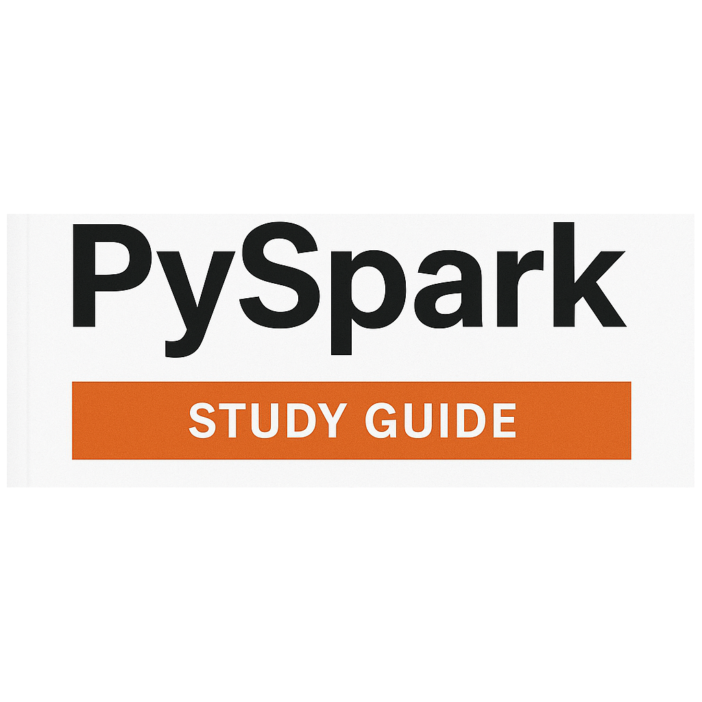

## Pyspark Study Guide

##### Published on {{PUBLISH_DATE}}
<!-- TITLE_IMAGE -->



### Index
[Broadcast Joins vs Skewed Joins](#what-are-broadcast-joins)
[Key spark concepts](#key-spark-concepts)


<a name="key-spark-concepts"></a>
### Key spark concepts

- Transformation: A method on a dataframe that returns another dataframe. 
- Action: A method on a dataframe which returns a value.
- Catalyst Optimizer: A Spark mechanism which asseses all the transformation it has to run, and figures out the most efficient way to run them together. 

<a name="diff-spark-concepts"></a>
### What’s the difference between SparkContext, SparkSession, and SQLContext?

They are all three entry points for interacting with the processing engine:

 - SparkContext: Is the original entrypoint for Spark. Designed to launch application, establish a connection to the cluster and manage operations on RDDs. Is focused on RDDs custom operations .
 - SparkSession: Is the modern entrypoint for Spark, unifying the different entrypoints and giving access to SparkSQL and Dataframes. 
 - SQLContext: Is the entrypoint for SparkSQL. Spark SQL is a Spark module for structured data processing. It provides an abstraction called DataFrames and it can act as a distributed SQL Engine.

```python
from pyspark import SparkContext

sc = SparkContext("local","MyApp")
rdd = sc.parallelize(['A','B','C','D'])
result = rdd.map(lambda c: ord(c)).collect()
print(result)
sc.stop()
```

```python
from pyspark.sql import SparkSession

spark = SparkSession.builder.appName("MyOtherApp").getOrCreate()
df = spark.createDataFrame([('Rosa María Casas del Campo',16,'Planeta Rica','Colombia','Null'),('Hideo Kojima',63,'Setagaya','Japón')],['name','age','city_of_birth','country_of_birth'])
df.show()
spark.stop()
```

### Differences instantiating SparkContext and SparkSession
 

Setting up Spark Context involves setting directly the spark master or using SparkConf for detailed configuration.

```python
from pyspark import SparkConf, SparkContext

conf = SparkConf().setMaster('local[0]').setAppName('MiAplicacion')
sc = SparkContext(conf = conf)
print(sc.applicationId)
sc.stop()
```

Spark session uses a builder pattern.

```python
from pyspark.sql import SparkSession

spark = SparkSession.builder\
    .appName('ProcesadorDeDatos')\
    .config('spark.executor.memory','1g')
    .getOrCreate()
print(spark.sparkContext.applicationId)
spark.stop()
```
### RDD support SparkContext vs Spark Session

SparkContext manages RDDs directly whereas SpárkSession had an imbeded SparkContext that handles these interactions

```python
from pyspark import SparkConf, SparkContext

sc = SparkContext('local[0]','MyRDDApp')
rdd = sc.parallelize(['A','B','C'])
print(rdd.collect())
sc.stop()
```
```python
from pyspark.sql import SparkSession

spark = SparkSession.builder.appName("RDDSparkSession").getOrCreate()
sc = spark.SparkContext
rdd = sc.parallelize([1,2,3])
print(rdd.collect())
sc.stop()
```

### DataFrame support SparkContext vs Spark Session

SparkContext does not support DataFrames only SparkSession does

```python
from pyspark.sql import SparkSession

spark = SparkSession.builder.appName("DataFrames").getOrCreate()
df = spark.createDataFrame([('AWS Redshift',2013),('Apache Spark', 2009)],['product','year_of_release'])
df_recent_releases = df.filter(df.year_of_release > 2010)
df_recent_releases.show()
spark.close()
```

### Difference between wide and narrow transformation in Pyspark

In spark narrow transformations are those that do not require a shuffle to perform. This increases the performance as the operations can be handled individually in their own partitions. What are some of these operations filter, map and union. Joins can be a narrow function only if the dataset is partitioned by the join key. 

On the contrary operations that do require shuffling between workers are called wide partitions. They have a performance penalty in execution time but on the other hand are sometimes unavoidable. Joins, groupbykey,  reduceByKey are operations that require shuffling of data. 

### Lazy evaluation in Spark 

Lazy evaluation is a feture on Spark that prevents transformations from being executed until an action is executed. Thanks to catalyst it looks at the most efficient way to combine the transformations. 

### Pyspark faster than pure Python 

It depends on how large the dataset. Pyspark is udually faster than python because it can distribute the workload in different nodes and process data in parallel. However there are 

### Practical problem 1

Given the following csv file
```
user_id;product_id;amount;city
1;101;12500.0;Bogota
2;102;9000.0;Cartagena
1;103;3000.0;Bogota
4;104;12500.0;Medellin
5;101;6250.0;Bogota
2;102;9000.0;Medellin
```
- Load the csv into a DataFrame
- Compute the total amount per user
- Compute the average transaction amount per city
- Filter only the cities where the average transaction amount > 8000
- Show results as two DataFrames total_per_user and city_avg
- Cache one of the dataframes. 


```python
from pyspark.sql import SparkSession
from pyspark.sql.types import StringType,DoubleType,StructType,IntegerType
from pyspark.sql.functions import col,avg

spark = SparkSession.builder.getOrCreate()

schema = StructType() \
      .add("user_id",IntegerType(),True) \
      .add("product_id",IntegerType(),True) \
      .add("amount",DoubleType(),True) \
      .add("city",StringType(),True)

df_products = spark.read.options(header=True,delimiter=";",schema=schema).csv('path/to/file')

total_per_user = df_products.groupBy('user').sum('amount')

filtered_avg_city = df_products.groupBy('city').agg(avg('amount').alias(avg_amount)).filter(col('avg_amount' > 8000)

filtered_avg_city.cache()
```

### Practical problem 2

Given the following csvs 

```csv
user_id;name
1;'Wilmer'
2;'Jayson'
```
```
user_id;product_id;amount
1;101;12500.0
1;102;8900.0
2;103;3000.0
2;101;5000.0
```

Load dataframes
Join Dataframes to get user names and transaction amounts
Compute total spent per user
Sort descending by total amount

```python
from pyspark.sql import SparkSession
from pyspark.sql.functions import col, sum,sort


spark = SparkSession.builder.getOrCreate()
df_user = spark.read.options(header=True,delimiter=";",inferSchema=True).csv("path/to/file")
df_transactions = spark.read.options(header=True,delimiter=";",inferSchema=True).csv("path/to/file")


df_user_transactions = df_user.join(df_transactions,df_user.user_id == df_transactions.user_id,"inner")
df_total_per_user = df_user_transactions.groupBy(col("name")).agg(sum("amount")).sort(col("amount").desc

```


### Practical problem 3

Consider the following dataframe


```python
from pyspark.sql import SparkSession

spark = SparkSession.builder.getOrCreate()

sales_df = spark.createDataFrame([
    ("2024-01-01", "A", 10),
    ("2024-01-02", "A", 15),
    ("2024-01-03", "A", 7),
    ("2024-01-01", "B", 20),
    ("2024-01-02", "B", 5)
], ["date", "store", "revenue"])

```

- Calculate the cumulative revenue over time for each store
- Day to day difference in spark

```python

from pyspark.sql import SparkSession
from pyspark.sql.window import Window
from pyspark.sql.functions import sum as _sum,

windowSpec = Window.partitionBy("store").orderBy("date")

spark = SparkSession.builder.getOrCreate()

window_revenue = sales_df.withColumn("window_sum" ,̣_sum("revenue").over(windowSpec)) \
                             .withColumn("day_to_day_diff" ,col("revenue") - lag("revenue").over(windowSpec))

window_revenue .show()
                                                                                                    

spark.stop()

```

### Whats the difference between cache and persist?

Cache will save the RDD or dataframe in meomory only. The persist method is used to store it at the level defined by user it can be MEMORY_ONLY, MEMORY_AND_DISK, DISK_ONLY etc. 

### Whatś a shuffle and why is it expensive?

A shuffle means that nodes have to send data across the cluster to other nodes to perform operations. These are called wide operations and the transmission of all this data  introduces an overhead in time and resource utilization. In extreme cases it can lead to job failure. 

### What's the role of the catalyst optimizer?

Catalyst optimizer eexamines the dag execution plan and proposes a specific order to apply the transformations so it is more optimal instead of resource usage. only available for dataframes and datasets.


### Name two ways to reduce shuffle in operations in Spark

One is to use narrow transformations whenever possible. The second is a broadcast in joins for tables that are small. 

### How would you debuf a job that takes much longer than expected?

I would start by examining the execution plan (df.explain() or Spark UI) to see which stages or transformations are triggering heavy shuffles or scans.

- Check if transformations can be reordered or combined for better efficiency.
- Cache or persist intermediate results to avoid recomputation.
- Increase memory or executors if the job is under-resourced.
- Look for data skew (uneven partition sizes).
- Use Spark UI or logs to pinpoint slow stages and test optimizations incrementally.

### Explain execution of a spark job from the moment an action is called. How is the DAG built? What is a stage? What are tasks? How are they distributed?

Once an action is called catalyst creates a graph from the action backwards looking at the previous transformation until it arrives to the sources datasets. A spark job is divided in stages that in turn those are a collection of tasks. There are narrow stages and wide stages. Narrow stages mean that there's no shufffle needed and that all the transformations are done in each worker. Whereas in wide stages there's shuffle of data between the partitions. 

### What's the difference between map(), flatMap() and mapPartitions()?

In map a function is applied to every element of the RDD. 
In flatmap a column produces one or more columns. 
In mapPartitions a function is applied to a whole partition instead of each element. Fort example if we wanted to get the average of a partition

examples:
map

```python
rdd = sc.parallelize([1, 2, 3, 4])
squared_rdd = rdd.map(lambda x: x**2)
squared_rdd.collect()

# output
[1, 4, 9, 16]
```

mapPartitions
```python
rdd = sc.parallelize([1, 2, 3, 4], 2)
def sum_partition(iterator):
    yield sum(iterator)

sum_rdd = rdd.mapPartitions(sum_partition)
sum_rdd.collect()

# output
[3, 7]
```

flatMap

```python
rdd = sc.parallelize(["hello world", "how are you"])

# define a function to split each line into words
def split_line(line):
    return line.split(" ")

flat_rdd = rdd.flatMap(split_line)
flat_rdd.collect()

# output
['hello', 'world', 'how', 'are', 'you']
```
 
<a name="what-are-broadcast-joins"></a>

### What are broadcast joins and skew joins? When do you use each? What are the symptoms of a skewed join? How can you detect and mitigate it?

Broadcast join is used when a table is very small to be joined with a bigger table so is worth it to broadcast it to the other nodes so the join is done in a more efficient way. A skewed join is when the join key is not evenly distributed creating overload in some partitions and not enough load in others. A sign a join is skewed, is that the partitions have very few items or too many. You can use salting to mitigate a skewed join. 

examples:

braodcast
```python
from pyspark.sql import SparkSession
from pyspark.sql.functions import col
from pyspark.sql.functions import lit, rand, floor,concat

spark = SparkSession.builder.getOrCreate()

data = [
('A', 100),
('A', 200),
('A', 300),
('B', 10),
('C', 20)
]

df = spark.createDataFrame(data, ['key','value'])


```
skewed salting

```python

# Number of salts
num_salts = 3

# Add random salt to key
df_salted = df.withColumn(
    "salt", floor(rand() * num_salts)
).withColumn(
    "salted_key", concat(col("key"), lit("_"), col("salt"))
)

df_salted.show()

```

### What do repartition and coalesce do?

- Repartition: reshuffles the whole dataframe and divides it into n number of partitions. It can shuffle data across workers.
- Coalesce: reduces the number of partitions to n number. It repartitions data reducing the data shuffled in the cluster. 