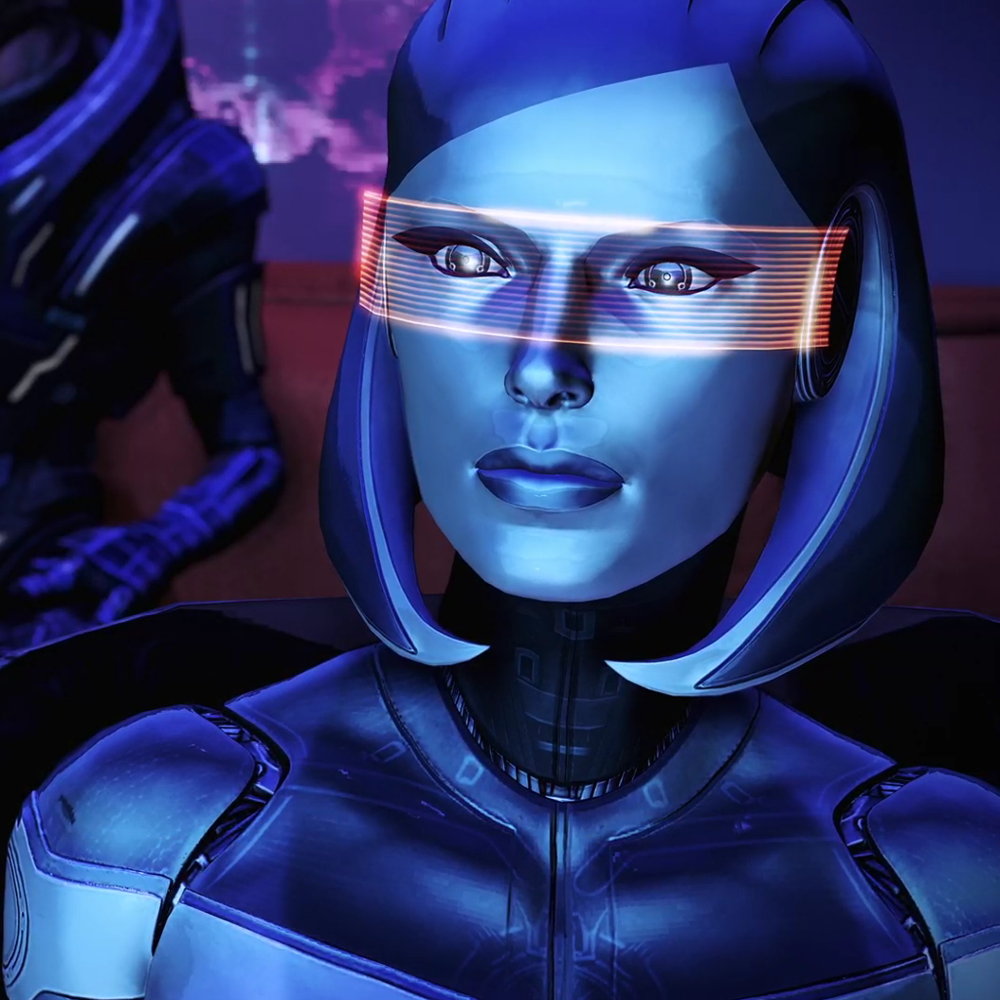

## Artificial Intelligence in Mass Effect

##### Published on {{PUBLISH_DATE}}

<!-- TITLE_IMAGE -->

Hey everyone! Today, I want to share my thoughts on one of my all-time favorite games, Mass Effect. If you haven’t played it yet, I highly recommend the Legendary Edition, released in 2021 by BioWare. It’s not just an epic space  RPG—it also serves as a great springboard to talk about key concepts in artificial intelligence (AI).

I’ll introduce the notions of Weak AI, Strong AI, and Superintelligence, using Mass Effect as an exciting backdrop. But first, let me give you a little context: Mass Effect is set in a universe where humanity is one of many advanced races in the galaxy. The central plot revolves around the looming threat of the Reapers, sentient machines that periodically wipe out all advanced civilizations every 50,000 years. Let’s dive in.

### Weak AI, Strong AI, and Superintelligence

To start, let’s explore three key AI concepts—Weak AI, Strong AI, and Superintelligence. These terms have their roots in philosophy, not computer science. In 1980, philosopher John Searle coined the terms Weak AI and Strong AI as part of his ['Chinese room" argument'](https://en.wikipedia.org/wiki/Chinese_room) . This argument suggests that no matter how sophisticated a program is, it lacks true understanding or consciousness, even if it appears intelligent. Meanwhile, the term [superintelligence](https://en.wikipedia.org/wiki/Superintelligence) was popularized by Swedish philosopher Nick Bostrom to describe any intellect that far surpasses human intelligence in virtually every domain.

Before we dive into the AI entities in Mass Effect, let's briefly define the three main AI concepts:

**Weak AI :** This refers to systems designed to perform specific tasks or solve particular problems. Think of the AI that powers Instagram filters, recognizing human faces and adding cute dog ears, or the virtual assistants in your smartphone that help set timers and turn off your lights. These systems are highly specialized but lack general intelligence. They’re brilliant in one area, but utterly incapable in others. Today, most of our AI falls into this category, excelling at specific tasks but without the flexibility of a human mind.

**Strong AI :** Strong AI is theoretical and would mirror human cognitive abilities. Unlike Weak AI, Strong AI would understand, learn, and apply knowledge across a wide range of tasks, just like a human.  A strong AI can reason and make decisions independently.  While we have no such AI today, it’s a major ambition in AI research. In sci-fi, we see Strong AI in characters like Sonny from 'I, Robot' or Erika from 'Ex-Machina' that can think, learn, and act with autonomy.

**Superintelligence:** Is a level of AI that surpasses human intelligence in all respects—problem-solving, creativity, wisdom, and emotional understanding. This theoretical AI is capable of rapid self-improvement and may reach a point of technological singularity, where it becomes uncontrollable or incomprehensible by humans. This makes me think of the movie 'Her'. The AI initially operates at a human level, but as it self-improves, it eventually evolves into something far beyond human understanding

### AI in Mass Effect: Entities, Races, and Systems

In Mass Effect, AI plays a critical role in shaping the narrative and gameplay. Let’s categorize a few of the AI characters and systems in the game using the definitions we just covered.

**The Citadel VIs - Weak AI**

The Citadel, a massive space station at the heart of galactic politics, hosts a range of Virtual Intelligences (VIs). These are classic examples of Weak AI. The most notable VI is Avina, who serves as a guide and information resource for visitors.

Avina can answer questions about Citadel locations, history, and transportation. While useful, her responses are limited to pre-programmed topics, and she lacks any initiative or memory of past interactions. Avina is similar to a voice assistant but with a holographic face.

**EDI (Enhanced Defense Intelligence) – From Weak AI to Strong AI**

One of the most interesting AI evolutions in the game is EDI(Enhanced Defense Intelligence), she is introduced in Mass Effect 2. When Shepard(The player) gets to command the new SR2 Normandy, we realize that Cerberus (the organization that build the ship) had installed a Virtual Intelligence to control the systems of the ship and aid in its defense. EDI explains that she is programmed to assist in tasks that require a reaction time that no human or alien can achieve. She also says that there are functions that are not available to her and will only be accesible to her if certain conditions are met, such as being attacked by an enymy ship. She also has the functionality to protect the information systems from hacking and analyze data provided by the commander. Once again, she also works as a ship guide and pops up in different areas of the ship, explaining the purpose of that section. At this stage, she's still a Weak AI—just controlling the ship's systems, answering basic questions, but again, no autonomy.

Then in Mass Effect 3, we see a big evolution in terms of complexity for this AI. It all starts when EDI installs herself inside a robot (mobile platform). She now becomes a possible team member. EDI asks herself questions, has initiative, and even starts to explore the possibility of having a relationship with the ship's pilot, Joker. She also has a good sense of humor. She learns, and she is quite autonomous, so we can say that at this point in the game, she is as intelligent as the other crew members (she even has more skills as she can control the ship as well). So we can conclude that she is a Strong AI.

**The Geth – Strong AI**

So this is an interesting one: the Geth. The Geth are a race of robots created by the Quarians (one of the races in the game) to serve as helpers and laborers. At one point, the Quarians started to fear that the Geth were getting too advanced and tried to exterminate them. This event caused the Geth to fear for their existence and strike back, resulting in the exile of the Quarians from their home planet, Rannoch. As we see from the Geth's actions, they have a sense of self, a sense of self-preservation, and autonomous decision-making.

Another interesting aspect of the Geth is that their bodies  function as some sort of terminal. They can collect experience autonomously, of course, but they can also connect or directly upload themselves to a hive-mind system called the Consensus, a shared network for decision-making. This networked intelligence makes them unique and places them firmly in the Strong AI category. They are capable of independent thought, self-preservation, and complex decision-making—traits that parallel ongoing research into distributed computing and swarm intelligence.

It is clear to me that in this categorization, they belong to the Artificial General Intelligence category. Their networked intelligence mirrors modern AI research into distributed computing and swarm intelligence, where individual units share computational power to achieve collective tasks.

The Geth’s story embodies  our fear  that once AI gains self-awareness, it could turn against us. While the Geth originally served a peaceful purpose, they entered in conflict with their creators effectively banishing them from their homeplanet.  Luckily, no such machine exist nowadays.

**The Reapers – Superintelligence**

Finally, we come to the Reapers, the ultimate antagonists in Mass Effect and a prime example of Superintelligence. These sentient machines, resembling massive squid-like spaceships, have existed for millennia, orchestrating cycles of destruction and creation in the galaxy.

The Reapers are incomprehensibly advanced, controlling the very fabric of galactic civilization. They built the Citadel and the mass relays, guiding the technological development of countless species, only to wipe them out every 50,000 years. Their motivations are beyond human understanding, and their technology is far superior to anything else in the galaxy.

The Reapers also possess the terrifying ability to indoctrinate individuals—slowly eroding their free will and turning them into unwitting puppets. This makes the Reapers an embodiment of the potential dangers of Superintelligence: an AI so far beyond our understanding that it not only outsmarts us but manipulates us in ways we cannot resist or comprehend.

### Conclusion

If you enjoy thought-provoking sci-fi with plenty of action, humor, and adventure, the Mass Effect trilogy is a must-play. I hope this article has given you a fresh perspective on AI concepts, while also sparking your interest in the fascinating universe of Mass Effect. I hope you enjoyed reading this article as much as I enjoyed writing it, thanks for reading. 