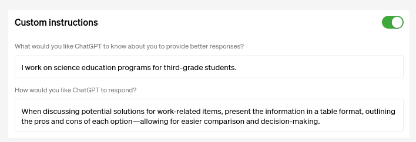

## Review of chat GPT store

##### Published on {{PUBLISH_DATE}}

<!-- TITLE_IMAGE -->

On January 10, OpenAI announced the creation of the ChatGPT Store. In this article, I will attempt to explain what this new development entails.To provide context, I'll review some previous announcements that are key to understanding the Store.

The first announcement, made on July 20th, 2023, introduced 'custom instructions.' According to OpenAI's article:

"ChatGPT will consider your custom instructions for every conversation going forward. The model will take into account these instructions each time it responds, eliminating the need to repeat your preferences or information in every conversation."

Here’s an illustrative example from OpenAI’s website:

“A teacher crafting a lesson plan for 3rd grade science no longer needs to specify the grade level each time.”

Essentially, custom instructions allowed users to streamline their interactions with ChatGPT.

Then, on November 6th, 2023, OpenAI introduced 'GPTs' — custom versions of ChatGPT tailored for specific purposes. Users can input data for ChatGPT to analyze, focusing its capabilities on a particular task.

For instance, I wanted to create a custom version of ChatGPT to assist with writing technical articles on new technologies in 
artificial intelligence and cloud computing. The interaction with the system felt intuitive. Through a simple series of questions, 
I configured my 'tech scribe’ GPT.  Below is the conversation I had with the GPT Builder to create this specialized version.

After this process, you can interact with your newly created GPT in the preview section. 
                In the GPT Builder's 'configure' tab, there's a form summarizing the input information for the GPT's creation.

On the right side of the screen, there’s a preview console for interacting with your new GPT. As a test, I asked it to write an article explaining the concept of kernels in deep learning and to create a header image for this article.

The results were very satisfying. The text was technical yet comprehensible, as requested, and the generated image evoked concepts such as matrices and neural networks.

Once satisfied with the outcome, you can save the GPT either for private use or share it publicly in the ChatGPT Store.

If saved privately, it appears in your ChatGPT interface for personal use. If shared publicly, it becomes available in the ChatGPT Store for others to use.

And this is how we arrive at the Store. Once the GPT is approved, we can engage with the community by sharing our creations and ideas in the form of GPTs.The GPT Store showcases these GPTs, categorizing them into sections and featuring the trending ones. It
 represents an opportunity to collaborate with others, challenge ourselves, and explore new ideas that could potentially solve automation problems for many people.

Once inside the store the usage is as simple as searching for and clicking on the desired GPT and logging in to ChatGPT. 
Then it should appear in your interface ready to use.

However, I encountered a user interface issue. While logged into ChatGPT, I couldn't access the GPT Store directly. The 'explore' option only showed GPTs I had previously used or those created by OpenAI.To find a specific GPT, I had to open a new private 
browser window, search for the GPT, copy its link, and then access it from my logged-in session. Addressing this issue would significantly enhance the user experience.

In summary, we have reviewed the concepts of Custom Instructions and GPTs, and how they integrate with the GPT Store. The community's role will be crucial for the success of this initiative, as well as the effectiveness of the ranking system and the advancements of ChatGPT capabilities. Additionally, the creativity of individuals in identifying new and interesting problems that can be solved through this tool will be a key factor in its success.