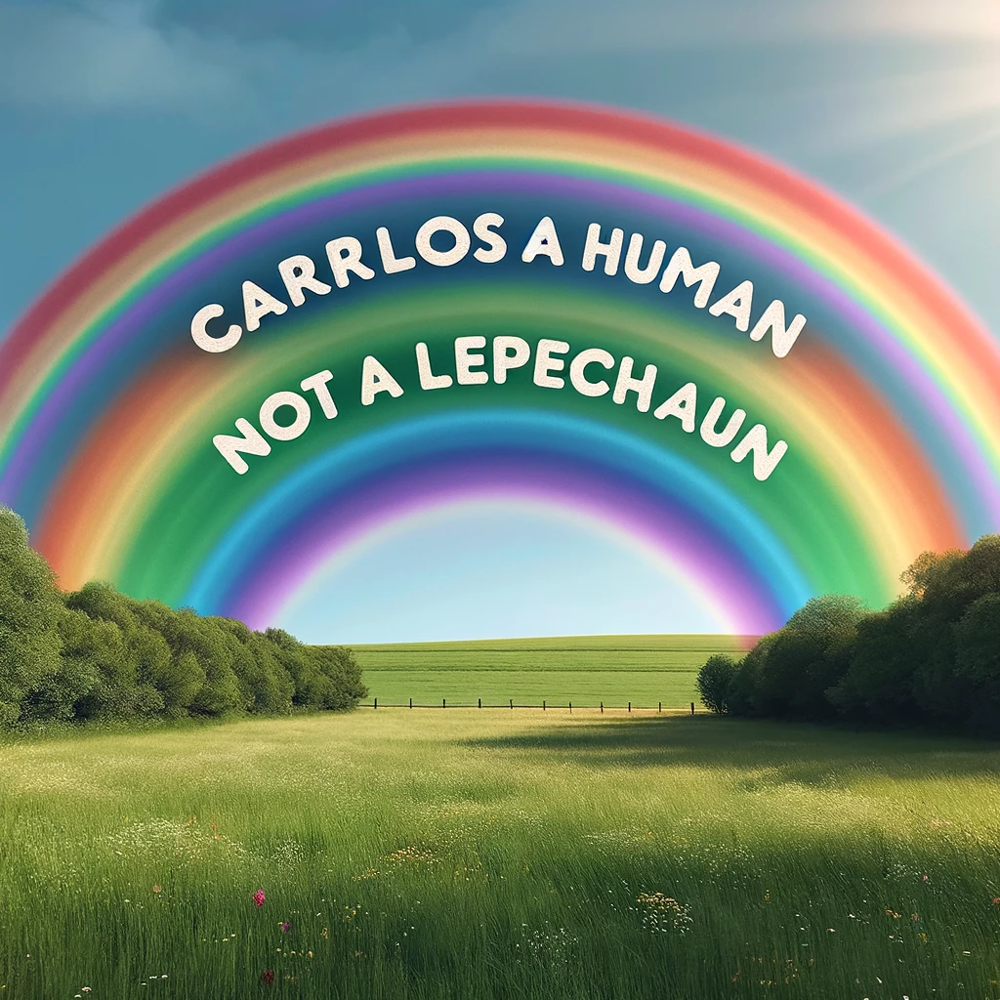
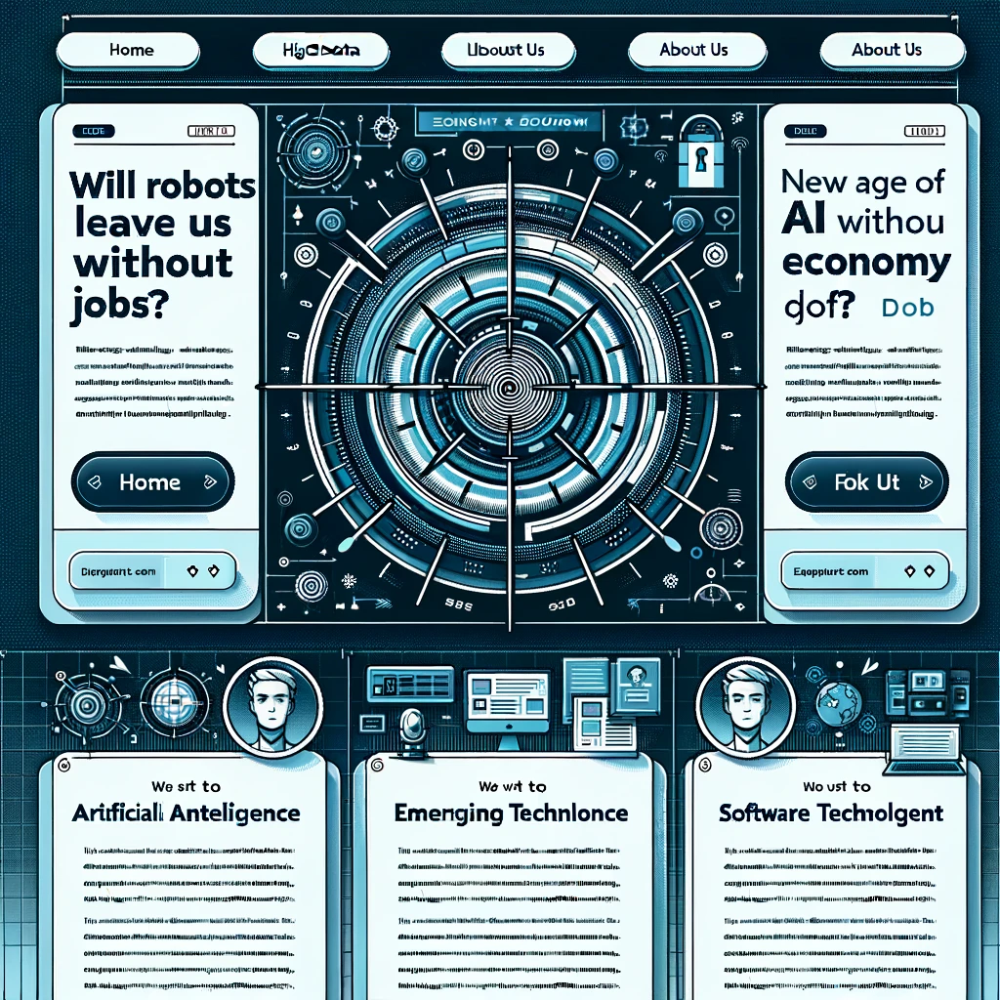
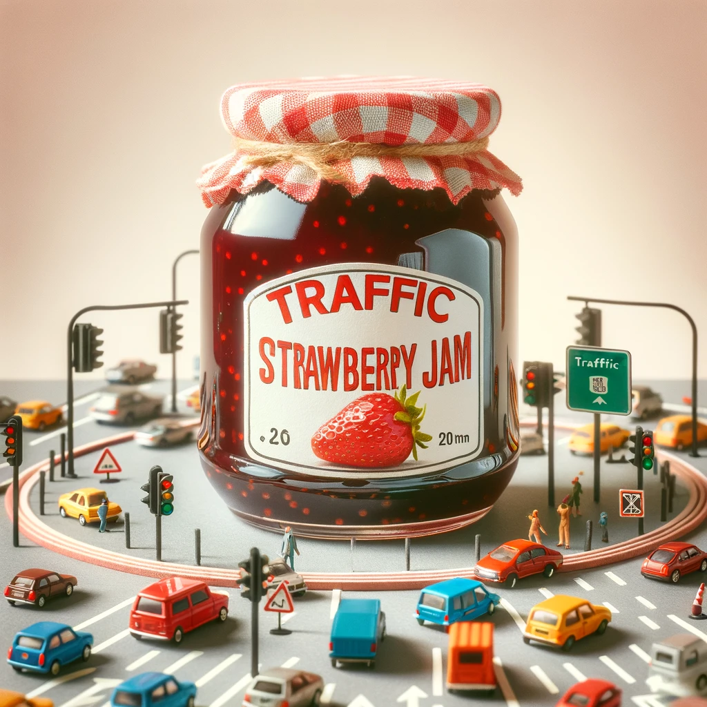

## Dall-e 3 user's test

##### Published on {{PUBLISH_DATE}}

<!-- TITLE_IMAGE -->

*Disclaimer: Dall-E 3 is exclusively available in the paid version of ChatGPT.*

Today, I am excited to share with you some fascinating challenges I've recently undertaken using DallE-3, OpenAI's text-based image generator.Here's a fun fact: the name 'Dall-E' is a blend of Wall-E (the adorable Pixar character) and Salvador Dalí, the legendary artist.

This tool is nothing short of remarkable, greatly simplifying the image generation process. Using it is a breeze; you simply provide an idea as input, and the model crafts an image based on that concept.

One of my initial experiments was to request an image depicting a coffee farmer with Pikachu (yes, the character from Pokémon).These are two wildly different concepts, yet the result was simply spectacular!The coffee plantation and the farmer were depicted with striking realism, and Pikachu appeared as if it had stepped right out of its fictional world.There were some deviations from the original character, notably the long tail with a furball, but I must say, I was thoroughly impressed.The image radiates a unique charm, merging the two concepts seamlessly. It's so impressive that I am considering printing it out to adorn my wall.

*Image created by ChatGPT, OpenAI. 20th February 2024*

But all technologies, especially new ones, have shortcomings that are hard to overcome. Now, let me share with you a few examples where the image generation went a bit sideways.

### Text quoting in images

I decided to start with something simple, so I gave ChatGPT this command:

**Can you generate an image of a field and a rainbow and inside the rainbow the following text "Carlos is a human not a leprechaun"?**

*Image created by ChatGPT, OpenAI. 20th February 2024*

I must say, I was half satisfied with the result. The text was quoted correctly, which is a big win. However, it doesn't blend well with the image; it looks imposed and artificial, and most importantly, it is below the rainbow but not inside.

So I tried again this time asking:

**Can you generate an image of a field and a rainbow and inside the rainbow the following text "Carlos is a human not a leprechaun"?make sure the text follows the rainbow's shape.**

*Image created by ChatGPT, OpenAI. 20th February 2024*

This attempt was a mixed bag. The text was where I expected it to be – that's a win! The letters were clear and readable.But the main issue, a recurring one for DALL-E, was the addition or removal of letters, even though I provided the same text. 'Carlos' gained an extra 'R', and 'leprechaun' lost one. It seemed as if the model had a quirky form of dyslexia.

### Web interface generation

Next, I wanted DALL-E 3 to assist me in generating an interface template for an imaginary blog.

My first command was:

**Can you create an interface for a technology blog with text clearly displayed?**

*Image created by ChatGPT, OpenAI. 20th February 2024*

The initial result was underwhelming. The text wasn't in English or even coherent; it was a jumble of letters. The overall image was quite disappointing and far from ready for any production process.

Determined, I gave ChatGPT a more detailed request, hoping to iron out some issues. The command was:

**Can you create an interface for a technology blog ? I would like buttons that redirect to home, big data, artificial intelligence, economy, emerging technologies, about us and contact. I would also like three articles to be displayed in the interface,The articles should contain the following headers "Will robots leave us without jobs?", "How to implement AI in the modern office?" ,"The new age of software development". Also I would like the logo of the blog to be based on a radar.**

*Image created by ChatGPT, OpenAI. 20th February 2024*

Now we are getting somewhere. The interface looks much nicer and cohesive.The radar as a logo is present. However, I was still disappointed; there are sections that are repeated,such as the home button twice. There is a title for every article, which is good, but not only are there letters and numbers randomly added or removed, sometimes even the letters seem to be drawn incorrectly. The text for each article simply doesn't make any sense. It seems like a random collection of letters that are visually acceptable but there is nothing coherent or related that can be read. It is quite ironic that Chat GPT produces such sophisticated and correct texts, and DALL-E 3 seems incapable of understanding even the most basic concepts of grammar. But that seems to be the reality today.

As a last attempt, I added,

**I want the text of each article to be written in English. The text should be related to the header above it.**

*Image created by ChatGPT, OpenAI. 20th February 2024*

Firstly, the obvious: there was no improvement in the text generation for the articles.I could say there was even a downgrade, as now the characters are not clearly readable. This example has some interesting aspects though.One of the headers is perfectly readable according to the given input, 'Will robots leave us without jobs?'But the others are not. In some cases, it seems that for DALL-E 3, the order of the letters is irrelevant, or that it makes weird and grammatically incorrect choices if the space is not enough.Some sections are just missing, and others are repeated many times.

For this particular use case, it's a decent templating tool for creating a quick prototype.However, human intervention and specialized software are still necessary for a viable final product.Particularly, text generation is a significant flaw.

Then I asked,

**Draw a sorcerer holding a stick on her left hand**

*Image created by ChatGPT, OpenAI. 20th February 2024*

Then I asked, **"Draw a sorcerer holding a stick in her left hand."** DALL-E 3 understood my request to some extent; the sorcerer was holding a stick, but with both hands. It lacked the intelligence to infer that 'holding it with her left hand' meant using only that hand. However, I could argue that my instructions weren't specific enough.

So, I tried a new request:

**Draw a sorcerer holding a stick only with her left hand**

*Image created by ChatGPT, OpenAI. 20th February 2024*

The image showed the sorcerer holding it in the right hand. It seems DALL-E doesn't fully understand the positioning of body parts, similar to the mistake some humans make when looking in a mirror.

I discovered that DALL-E 3 is a fun tool for creating publicity posters, which makes sense, given how pervasive advertising is in our society. So, I thought about how a poster for a French perfume in Colombia would look according to ChatGPT and asked:

**Can you create a publicity poster for french perfumes for the Colombian market?**

*Image created by ChatGPT, OpenAI. 20th February 2024*

I really loved the result; it looked so typical, I would dare to say even stereotypical, of Colombia, with the flowers, the colonial architecture, and the mountains. It reminded me of some rural towns in the country. And the flask of perfume looks so chic and elegant, reminiscent of French sophistication. A subtle blend. Yet, the only problem is that the text was wrong. Not as wrong as in other cases; for some reason, in my head, it even sounded a bit Portuguese or some other Romance language, with the accents over the 'A' in 'Fráncesesa' that should be 'Francesa,' anyway, or 'Excéconalles' that should be 'excepcionales.' The only issue was the text – not completely wrong, but slightly off, almost sounding like Portuguese. The text placement was correct; it just wasn't in Spanish. But it was almost understandable. The correct texts should be:

Next up:

**Can you draw me an uml class diagram for a shop?**

*Image created by ChatGPT, OpenAI. 20th February 2024*

Although quite cute, this image has some problems. The most obvious issue is its failure to adhere to the UML standard. There is a specific convention for representing a class or an interface, such as using arrows to denote relationships between classes, like inheritance or dependency. Although the image is visually appealing, it does not conform to these standards. Furthermore, disregarding the repeated labels and misspelled words, it's impossible to envision a real piece of software based on this image.

*can you draw me a database entity relationship diagram for a restaurant ?*

*Image created by ChatGPT, OpenAI. 20th February 2024*

Once again, we encounter the same issue: a visually stunning image marred by incoherent text that fails to adhere to specific standards and does not offer a clear enough depiction of a database schema.

When we refine the request, we achieve a slightly improved outcome

**can you draw me a database entity relationship diagram for a restaurant that respect's peter chen's standard?**

*Image created by ChatGPT, OpenAI. 20th February 2024*

While this result comes closer to meeting expectations, it still has several issues. For starters, there are grammatical mistakes, like 'Empiloyee' instead of 'Employee.' The entity table, specifically the restaurant table, is redundantly repeated. Moreover, the relationships between entities, typically represented inside a diamond, are missing. Relationships in such diagrams are akin to verbs connecting entities, for instance, 'employee serves tables.' Unfortunately, this crucial aspect is completely absent in the image, rendering it nonsensical."

Finally, I wanted to test DALL-E 3 with two concepts using the same word. Would it choose traffic jam or strawberry jam? The results were super cute, surprising, and fun. I asked,

**Please draw a traffic jam strawberry**

*Image created by ChatGPT, OpenAI. 20th February 2024*

**Please draw me a strawberry traffic jam**

*Image created by ChatGPT, OpenAI. 20th February 2024*

**Please draw me a traffic strawberry jam**

*Image created by ChatGPT, OpenAI. 20th February 2024*

I wanted to end on this note because it was the most enjoyable part of the test. I believe one of DALL-E's greatest strengths is creatively mixing concepts.  It's fantastic for prototyping new ideas and expanding creativity, all within seconds.One of its most significant weaknesses is the generation of images containing coherent text. This issue greatly diminishes its utility for creating web interfaces or advertising images where the message is crucial. At the very least, it necessitates some post-processing; it's not a solution ready for immediate use.Another notable weakness is the accurate generation of diagrams that adhere to specific standards. DALL-E is not programmed to follow these strict guidelines, nor does it fully comprehend the systems these standards represent.My final thought: This tool, despite its imperfections, significantly accelerates the process of image generation. It democratizes, streamlines, and reduces the costs of creating images, particularly benefiting small businesses and individual users who lack access to a marketing team or design professionals.

