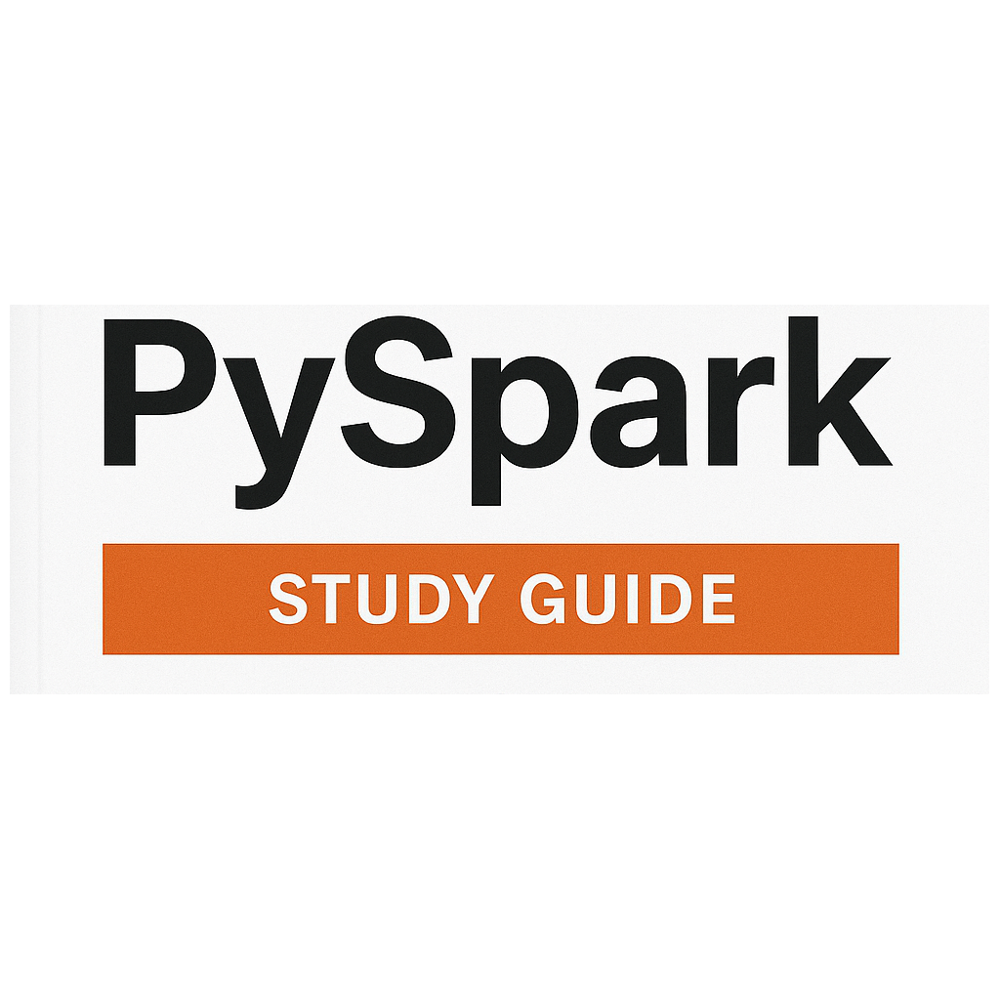

## Guía de estudio de Pyspark

##### Published on {{PUBLISH_DATE}}
<!-- TITLE_IMAGE -->



### Índice
[Uniones de difusión vs. Uniones sesgadas](#what-are-broadcast-joins)
[Conceptos clave de Spark](#key-spark-concepts)

<a name="key-spark-concepts"></a>
### Conceptos clave de Spark

- Transformación: Un método en un dataframe que devuelve otro dataframe.
- Acción: Un método en un dataframe que devuelve un valor.
- Optimizador Catalyst: Un mecanismo de Spark que evalúa todas las transformaciones que debe ejecutar y determina la forma más eficiente de ejecutarlas juntas.

<a name="diff-spark-concepts"></a>
### ¿Cuál es la diferencia entre SparkContext, SparkSession y SQLContext?

Son tres puntos de entrada para interactuar con el motor de procesamiento:

- SparkContext: Es el punto de entrada original de Spark. Diseñado para iniciar la aplicación, establecer una conexión con el clúster y administrar las operaciones en los RDD. Se centra en operaciones personalizadas de RDD.
- SparkSession: Es el punto de entrada moderno para Spark, unificando los diferentes puntos de entrada y dando acceso a SparkSQL y DataFrames.
- SQLContext: Es el punto de entrada para SparkSQL. Spark SQL es un módulo de Spark para el procesamiento de datos estructurados. Proporciona una abstracción llamada DataFrames y puede actuar como un motor SQL distribuido.

```python
from pyspark import SparkContext

sc = SparkContext("local","MiAplicación")
rdd = sc.parallelize(['A','B','C','D'])
result = rdd.map(lambda c: ord(c)).collect()
print(result)
sc.stop()
```

```python
from pyspark.sql import SparkSession

spark = SparkSession.builder.appName("MiOtraAplicación").getOrCreate()
df = spark.createDataFrame([('Rosa María Casas del Campo',16,'Planeta Rica','Colombia','Null'),('Hideo Kojima',63,'Setagaya','Japón')],['nombre','edad','ciudad_de_nacimiento','país_de_nacimiento'])
df.show()
spark.stop()
```

### Diferencias entre la instanciación de SparkContext y SparkSession

Para configurar Spark Context, es necesario configurar directamente el Spark Master o usar SparkConf para una configuración detallada.

```python
from pyspark import SparkConf, SparkContext

conf = SparkConf().setMaster('local[0]').setAppName('MiAplicacion')
sc = SparkContext(conf = conf)
print(sc.applicationId)
sc.stop()
```

La sesión de Spark utiliza un patrón de constructor.

```python
from pyspark.sql import SparkSession

spark = SparkSession.builder\
.appName('ProcesadorDeDatos')\
.config('spark.executor.memory','1g')
.getOrCreate()
print(spark.sparkContext.applicationId)
spark.stop()
```
### Compatibilidad con RDD: SparkContext vs. Spark Session

SparkContext gestiona los RDD directamente, mientras que SparkSession tenía un SparkContext integrado que gestiona estas interacciones.

```python
from pyspark import SparkConf, SparkContext

sc = SparkContext('local[0]','MyRDDApp')
rdd = sc.parallelize(['A','B','C'])
print(rdd.collect())
sc.stop()
```
```python
from pyspark.sql import SparkSession

spark = SparkSession.builder.appName("RDDSparkSession").getOrCreate()
sc = spark.SparkContext
rdd = sc.parallelize([1,2,3])
print(rdd.collect())
sc.stop()
```

### Compatibilidad con DataFrame: SparkContext vs. Spark Session

SparkContext no admite DataFrames, solo SparkSession sí.

```python
from pyspark.sql import SparkSession

spark = SparkSession.builder.appName("DataFrames").getOrCreate()
df = spark.createDataFrame([('AWS Redshift',2013),('Apache Spark', 2009)],['product','year_of_release'])
df_recent_releases = df.filter(df.year_of_release > 2010)
df_recent_releases.show()
spark.close()
```

### Diferencia entre transformación amplia y estrecha en PySpark

En Spark, las transformaciones estrechas son aquellas que no requieren reorganización. Esto aumenta el rendimiento, ya que las operaciones se pueden gestionar individualmente en sus propias particiones. Algunas de estas operaciones son: filtro, mapa y unión. Las uniones solo pueden ser una función estrecha si el conjunto de datos está particionado por la clave de unión.

Por el contrario, las operaciones que requieren reorganización entre trabajadores se denominan particiones amplias. Implican una penalización de rendimiento en tiempo de ejecución, pero a veces son inevitables. Las uniones, agrupar por clave y reducir por clave son operaciones que requieren reorganización de datos.

### Evaluación diferida en Spark

La evaluación diferida es una función de Spark que impide que las transformaciones se ejecuten hasta que se ejecute una acción. Gracias a Catalyst, busca la forma más eficiente de combinar las transformaciones.

### PySpark es más rápido que Python puro

Depende del tamaño del conjunto de datos. PySpark suele ser más rápido que Python porque puede distribuir la carga de trabajo en diferentes nodos y procesar los datos en paralelo. Sin embargo, existen...

### Problema práctico 1

Dado el siguiente archivo CSV:
```
ID_usuario;ID_producto;Importe;Ciudad
1;101;12500.0;Bogotá
2;102;9000.0;Cartagena
1;103;3000.0;Bogotá
4;104;12500.0;Medellín
5;101;6250.0;Bogotá
2;102;9000.0;Medellín
```
- Cargar el CSV en un DataFrame
- Calcular el importe total por usuario
- Calcular el importe medio de las transacciones por ciudad
- Filtrar solo las ciudades con un importe medio de transacciones > 8000
- Mostrar los resultados como dos DataFrames: total_per_user y city_avg
- Almacenar en caché uno de los DataFrames. ```python
desde pyspark.sql importar SparkSession
desdepyspark.sql.types importa StringType, DoubleType, StructType, IntegerType
from pyspark.sql.functions importa col, avg

spark = SparkSession.builder.getOrCreate()

schema = StructType() \
.add("id_usuario", IntegerType(), True) \
.add("id_producto", IntegerType(), True) \
.add("cantidad", DoubleType(), True) \
.add("ciudad", StringType(), True)

df_products = spark.read.options(header=True,delimiter=";",schema=schema).csv('ruta/al/archivo')

total_por_usuario = df_products.groupBy('usuario').sum('cantidad')

filtered_avg_city = df_products.groupBy('city').agg(avg('amount').alias(avg_amount)).filter(col('avg_amount' > 8000)

filtered_avg_city.cache()
```

### Problema práctico 2

Dados los siguientes archivos CSV:

```csv
user_id;name
1;'Wilmer'
2;'Jayson'
```
```
user_id;product_id;amount
1;101;12500.0
1;102;8900.0
2;103;3000.0
2;101;5000.0
```

Cargar marcos de datos
Unir marcos de datos para obtener los nombres de usuario y los importes de las transacciones
Calcular el gasto total por usuario
Ordenar en orden descendente por total Cantidad

```python
de pyspark.sql import SparkSession
de pyspark.sql.functions import col, sum,sort

spark = SparkSession.builder.getOrCreate()
df_user = spark.read.options(header=True,delimiter=";",inferSchema=True).csv("ruta/al/archivo")
df_transactions = spark.read.options(header=True,delimiter=";",inferSchema=True).csv("ruta/al/archivo")

df_user_transactions = df_user.join(df_transactions,df_user.user_id == df_transactions.user_id,"inner")
df_total_por_usuario = df_user_transactions.groupBy(col("nombre")).agg(suma("cantidad")).sort(col("cantidad").desc

```

### Problema práctico 3

Considere el siguiente dataframe:

```python
from pyspark.sql import SparkSession

spark = SparkSession.builder.getOrCreate()

sales_df = spark.createDataFrame([
("2024-01-01", "A", 10),
("2024-01-02", "A", 15),
("2024-01-03", "A", 7),
("2024-01-01", "B", 20),
("2024-01-02", "B", 5)
], ["fecha", "tienda", "ingresos"])

```

- Calcular Ingresos acumulados a lo largo del tiempo para cada tienda
- Diferencia diaria en Spark

```python

from pyspark.sql import SparkSession
from pyspark.sql.window import Window
from pyspark.sql.functions import sum as _sum,

windowSpec = Window.partitionBy("store").orderBy("date")

spark = SparkSession.builder.getOrCreate()

window_revenue = sales_df.withColumn("window_sum" ,̣_sum("revenue").over(windowSpec)) \
.withColumn("day_to_day_diff" ,col("revenue") - lag("revenue").over(windowSpec))

window_revenue .show()

spark.stop()

```

### ¿Cuál es la diferencia entre caché y persistencia?

La caché guarda el RDD o dataframe solo en memoria. El método de persistencia se utiliza para almacenarlo en el nivel definido por el usuario; puede ser SOLO MEMORIA, MEMORIA Y DISCO, SOLO DISCO, etc.

### ¿Qué es una mezcla y por qué es costosa?

Una mezcla implica que los nodos deben enviar datos a través del clúster a otros nodos para realizar operaciones. Estas se denominan operaciones amplias y la transmisión de todos estos datos introduce una sobrecarga en el tiempo y el uso de recursos. En casos extremos, puede provocar un fallo en el trabajo.

### ¿Cuál es la función del optimizador Catalyst?

El optimizador Catalyst examina el plan de ejecución del DAG y propone un orden específico para aplicar las transformaciones de forma que sea más óptimo en lugar de limitar el uso de recursos. Solo está disponible para dataframes y conjuntos de datos.

### Mencione dos maneras de reducir la mezcla en las operaciones en Spark.

Una es usar transformaciones estrechas siempre que sea posible. La segunda es una difusión en las uniones para tablas pequeñas.

### ¿Cómo lo haría? ¿Depurar un trabajo que tarda mucho más de lo esperado?

Empezaría examinando el plan de ejecución (df.explain() o Spark UI) para ver qué etapas o transformaciones están provocando reorganizaciones o escaneos intensos.

- Verificar si las transformaciones se pueden reordenar o combinar para una mayor eficiencia.
- Almacenar en caché o conservar los resultados intermedios para evitar recálculos.
- Aumentar la memoria o los ejecutores si el trabajo tiene recursos insuficientes.
- Buscar sesgos en los datos (tamaños de partición desiguales).
- Usar Spark UI o los registros para identificar etapas lentas y probar optimizaciones de forma incremental.

### Explicar la ejecución de un trabajo de Spark desde el momento en que se llama a una acción. ¿Cómo se construye el DAG? ¿Qué es una etapa? ¿Qué son las tareas? ¿Cómo se distribuyen?

Una vez que se llama a una acción, el catalizador crea un grafo desde la acción hacia atrás, analizando la transformación anterior hasta que llega a los conjuntos de datos de origen. Un trabajo de Spark se divide en etapas que, a su vez, son un conjunto de tareas. Hay etapas estrechas y etapas amplias. Las etapas estrechas significan que no hay Se requiere la reorganización y todas las transformaciones se realizan en cada trabajador. Mientras que en las etapas amplias, los datos se reorganizan entre las particiones.

### ¿Cuál es la diferencia entre map(), flatMap() y mapPartitions()?

En map, una función se aplica a cada elemento del RDD.

En flatmap, una columna produce una o más columnas.

En mapPartitions, una función se aplica a una partición completa en lugar de a cada elemento.. Por ejemplo, si quisiéramos obtener el promedio de una partición

Ejemplos:
map

```python
rdd = sc.parallelize([1, 2, 3, 4])
squared_rdd = rdd.map(lambda x: x**2)
squared_rdd.collect()

# salida
[1, 4, 9, 16]
```

mapPartitions
```python
rdd = sc.parallelize([1, 2, 3, 4], 2)
def sum_partition(iterator):
yield sum(iterator)

sum_rdd = rdd.mapPartitions(sum_partition)
sum_rdd.collect()

# salida
[3, 7]
```

flatMap

```python
rdd = sc.parallelize(["hola mundo", "¿cómo estás?") tú"])

# Define una función para dividir cada línea en palabras
def split_line(line):
return line.split(" ")

flat_rdd = rdd.flatMap(split_line)
flat_rdd.collect()

# output
['hello', 'world', 'how', 'are', 'you']
```

<a name="what-are-broadcast-joins"></a>

### ¿Qué son las uniones de difusión y las uniones sesgadas? ¿Cuándo se usan cada una? ¿Cuáles son los síntomas de una unión sesgada? ¿Cómo se puede detectar y mitigar?

La unión de difusión se usa cuando una tabla es demasiado pequeña para unirse con una tabla más grande, por lo que conviene difundirla a los demás nodos para que la unión se realice de forma más eficiente. Una unión sesgada se produce cuando la clave de unión no se distribuye uniformemente, lo que genera sobrecarga en algunas particiones e insuficiente carga en otras. Una señal de que una unión está sesgada es que las particiones tienen muy pocos elementos o demasiados. Se puede usar sal para mitigar una unión sesgada. Ejemplos:

transmisión
```python
from pyspark.sql import SparkSession
from pyspark.sql.functions import col
from pyspark.sql.functions import lit, rand, floor,concat

spark = SparkSession.builder.getOrCreate()

data = [
('A', 100),
('A', 200),
('A', 300),
('B', 10),
('C', 20)
]
df = spark.createDataFrame(data, ['key','value'])

```
salación sesgada

```python

# Número de sales
num_salts = 3

# Añadir sal aleatoria a la clave
df_salted = df.withColumn(
"salt", floor(rand() * num_salts)
).withColumn(
"salted_key", concat(col("key"), lit("_"), col("salt"))
)

df_salted.show()

```

### ¿Qué hacen la repartición y la fusión?

- Repartición: reorganiza todo el dataframe y lo divide en n particiones. Permite reorganizar los datos entre los trabajadores.
- Fusión: reduce el número de particiones a n. Reparticiona los datos, reduciendo así la cantidad de datos reorganizados en el clúster.