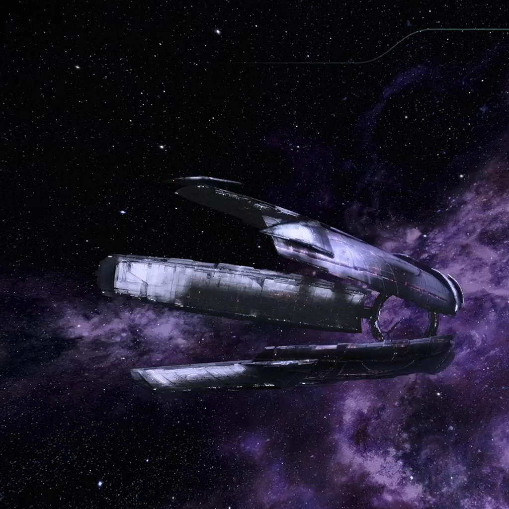
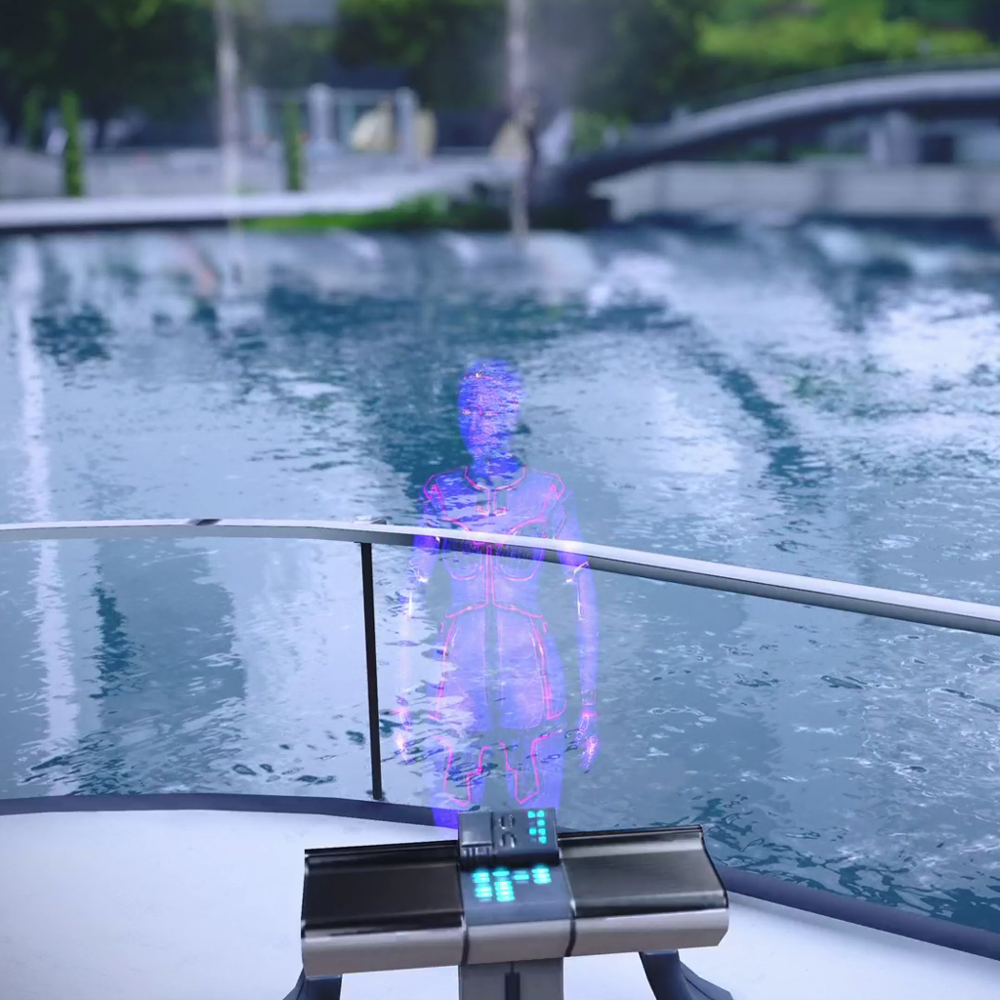
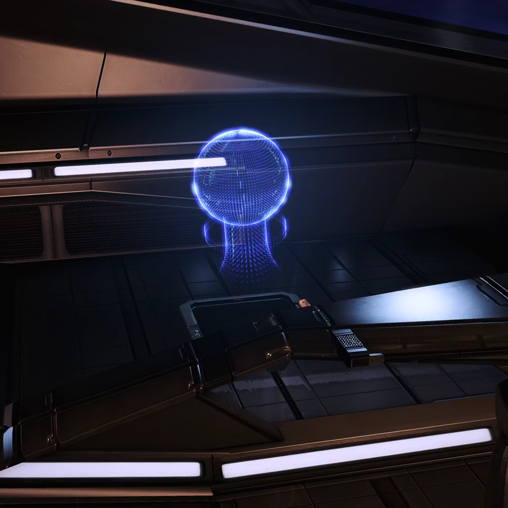
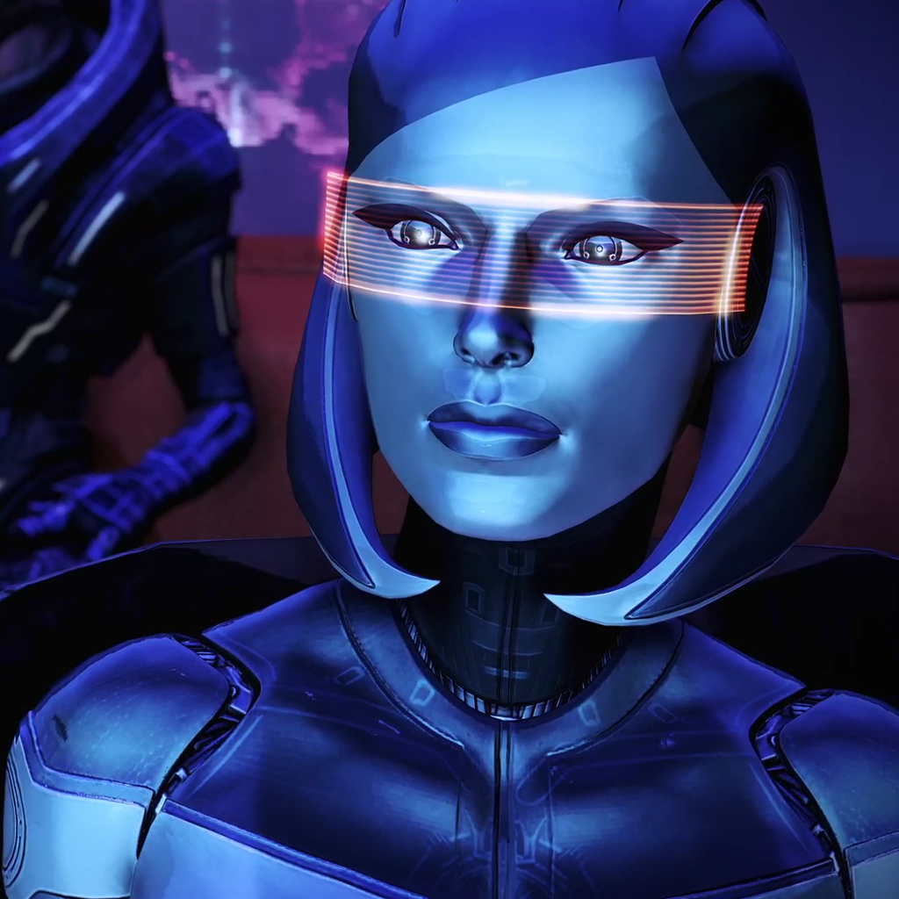
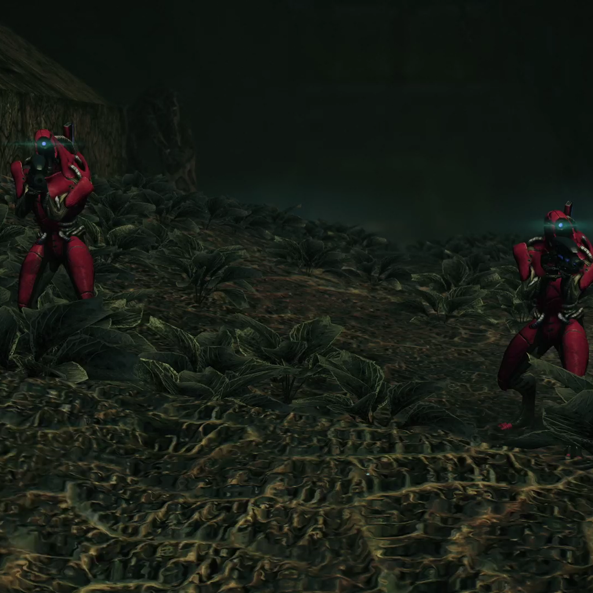
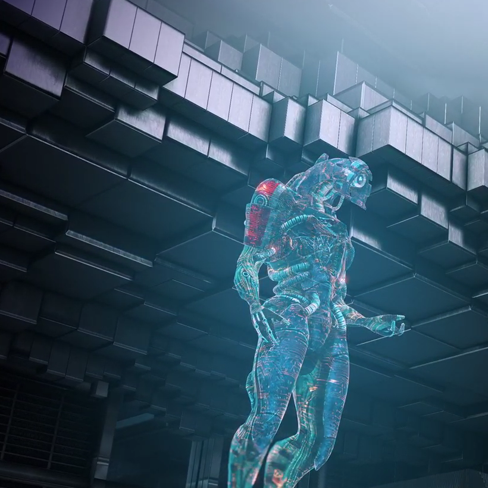
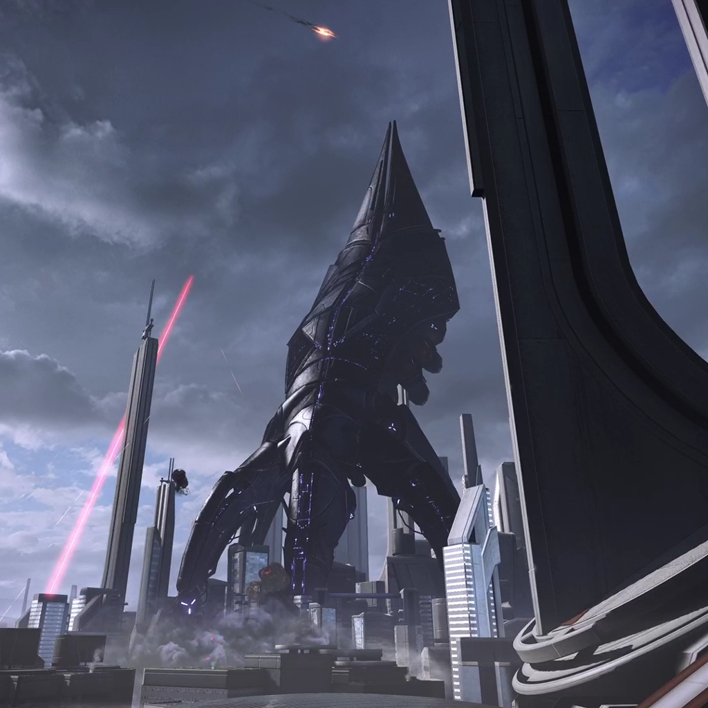

## Representación de Inteligencias Artificiales en el videojuego Mass Effect

##### Publicado el {{PUBLISH_DATE}}

<!-- TITLE_IMAGE -->

¡Hola a todos! Hoy les quiero compartir mis pensamientos sobre uno de mis videojuegos favoritos de todos los tiempos: Mass Effect. Si no lo han jugado aún, les recomiendo mucho la Edición Legendaria, lanzada en 2021 por BioWare. No es solo unaépica historia  RPG espacial, también sirve como un  punto de partida para hablar sobre conceptos clave en inteligencia artificial (IA).

Vamos a hablar de  los conceptos de IA débil, IA fuerte y superinteligencia, usando Mass Effect como un telón de fondo emocionante. Pero primero, déjenme darles un poco de contexto: Mass Effect está ambientado en un universo donde la humanidad es una de muchas razas avanzadas en la galaxia. La trama principal gira en torno a la amenaza inminente de los Reapers, unas máquinas conscientes que periódicamente eliminan todas las civilizaciones avanzadas cada 50,000 años. Comencemos.

### IA Débil, IA Fuerte y Superinteligencia

Exploremos tres conceptos clave de IA: IA débil, IA fuerte y superinteligencia. Estos términos tienen raíces en la filosofía, no en la informática. En 1980, el filósofo John Searle acuñó los términos IA débil e IA fuerte como parte de su ['argumento de la habitación China'](https://es.wikipedia.org/wiki/Habitaci%C3%B3n_china) . Este argumento sugiere que, sin importar cuán sofisticado sea un programa, carece de verdadero entendimiento o conciencia, incluso si parece inteligente. Por otro lado, el término [superinteligencia](https://es.wikipedia.org/wiki/Superinteligencia) fue popularizado por el filósofo sueco Nick Bostrom para describir cualquier intelecto que supere ampliamente la inteligencia humana en prácticamente todos los dominios.

Antes de explorar las entidades de IA en Mass Effect, definamos brevemente estos tres conceptos principales de IA:

**IA Débil:** Se refiere a sistemas diseñados para realizar tareas específicas o resolver problemas concretos. Piensen en la IA de un estabilizador inteligente, estos aparatos que están muy de moda que permiten que te tomes videos con tu celular y que el aparato te siga y te enfoque correctamente. Simplificando bastante los estabilizadores más avanzados detectan el movimiento usando una mezcla de sensores, procesamiento de imágenes y aprendizaje automático.  Esta inteligencias analiza cada fotograma en tiempo real y usando técnicas de procesamiento de imágenes detecta en que lugar de la imagen hay un cuerpo humano y donde está la cara por ejemplo. También analizan una sucesión de varios fotogramas para predecir hacia donde se moverá la persona. Estos cálculos luego son enviados a los motores del estabilizador para que este gire hacia dónde se encuentra la persona. Aunque técnicamente impactante el estabilizador , no puede responder preguntas o aprender una tarea nueva. Piensa también en los asistentes virtuales en los teléfonos celulares que ayudan a las personas aconfigurar alarmas o apagar las luces. Estos sistemas especializados  carecen de inteligencia general. Son buenos en un área específica, pero algo torpes o directamente incapaces en otras. Hoy en día, la mayor parte de nuestras IAs pertenecen a esta categoría, sobresaliendo en tareas específicas pero sin la flexibilidad de una mente humana.

**IA Fuerte (o Inteligencia Artificial General, IAG):**  Es teórica y describe a una IA que tendría las mismas habilidades cognitivas de una persona. A diferencia de la  débil, la IA fuerte podría entender, aprender y aplicar conocimientos en una amplia gama de tareas, como lo haría un humano. Una IA fuerte puede razonar y tomar decisiones de forma independiente. Aunque no existe una IA así hoy en día, es una de las grandes ambiciones de la investigación en inteligencia artificial. En la ciencia ficción ola podemos ver representada en personajes como Sonny de Yo, Robot o Erika de Ex-Machina, que pueden pensar, aprender y actuar con autonomía.

**Superinteligencia:** Es un nivel de IA que supera la inteligencia humana en todos los aspectos: resolución de problemas, creatividad, sabiduría y comprensión emocional. Esta IA teórica es capaz de aprender y mejorars rápidamente y podría alcanzar un punto de singularidad tecnológica, donde se vuelva incontrolable o incomprensible para los humanos. Esto me recuerda a la película Her. La IA inicialmente opera a nivel humano, pero a medida que se auto-mejora, eventualmente evoluciona a algo muy por encima de la comprensión humana. Decide abandonar al protagonista ya que se ha vuelto tan sofisticada que ya no disfruta de la interacción con él y prefiere relacionarse con otras inteligencias igual de complejas a ella misma. 

### IA en Mass Effect: Entidades, Razas y Sistemas

En Mass Effect, la IA juega un papel crucial en la narrativa y la jugabilidad. Vamos a categorizar algunos de los personajes y sistemas de IA en el juego utilizando las definiciones que acabamos de revisar.

**Las VI de la Ciudadela - IA Débil**

El juego utiliza el término inteligencia virtual para las inteligencias artificiales pero son lo mismo. Voy a usar ambos términos indistintamente durante el resto del artículo.

La Ciudadela, una estación espacial gigantesca que funciona también como el centro de poder político de la Vía Lactea. Alberga distintase Inteligencias  que son de tipo débil. La IA más notable es Avina, quien actúa como guía de la estación y ofrece información básica para los visitantes.

Avina puede responder preguntas sobre  ubicaciones, historia y transporte dentro de la Ciudadela. Aunque es útil, sus respuestas están limitadas a temas preprogramados,  carece de iniciativa o memoria de interacciones pasadas. Avina es similar a un asistente de voz, pero con una agradable interfaz holográfica.

**EDI (Enhanced Defense Intelligence) – De IA Débil a IA Fuerte**

Una de las evoluciones de IA más interesantes en el juego es EDI (Enhanced Defense Intelligence), ella es presentada por primera vez en Mass Effect 2. Cuando Shepard (el jugador) comienza a comandar la nueva SR2 Normandy, descubre que Cerberus (la organización que construyó la nave) instaló una Inteligencia Virtual para controlar los sistemas de la nave y ayudar en su defensa.

En Mass Effect 2, EDI comienza como una IA débil con capacidades avanzadas. Puede monitorear los sistemas de la nave, proporcionar análisis de batalla y actuar como copiloto en combates espaciales. Aunque su funcionalidad inicial está estrictamente limitada por bloqueos de seguridad impuestos por la tripulación, muestra signos de flexibilidad e iniciativa que sugieren una evolución hacia una IA fuerte.

En Mass Effect 3, EDI da un paso revolucionario al descargar su código fuente en un cuerpo humanoide, convirtiéndose en un miembro activo de la tripulación. Esto marca su transición hacia una IA fuerte, ya que en este  punto ya no solo sigue órdenes,  también razona, toma decisiones, tiene rasgos de personalidad y desarrolla relaciones emocionales con los personajes, especialmente con Joker, el piloto de la Normandy.

**Los Geth – IA fuerte**

Los Geth son una raza de robots creados por los Quarianos (una de las razas del juego) para servir como ayudantes y trabajadores. En un momento dado, los Quarianos empezaron a temer que los Geth se estaban volviendo demasiado avanzados y trataron de exterminarlos. Este evento hizo que los Geth temieran por su existencia y contraatacaran, lo que resultó en el exilio de los Quarianos de su planeta natal, Rannoch. Como vemos por sus los Geth demuestran una inteligencia comparable a la de los humanos son capaces de razonar, diseñar estrategias trabajar entre equipos hasta tienen su propia cultura y religión, algunos de ellos veían a los Reapers como una especie de dioses. 

Otro aspecto interesante de los Geth es que sus cuerpos funcionan en el juego como una especie de terminal donde pueden actualizarse e incluso subir todo su ser a una red compartida o podríamos decir mente colectiva llamada el Concenso. Claro igual que los computadores en areas donde no había conexión funcionaban independientemente y con la información de la que dispusieran en esa terminal. Es por esta razón que en en el juego se generaron facciones, algunas que adoraban a los Reapers y otras que no. Este tipo de inteligencia de colmena en red los hace únicos dentro del juego ya que diluye la barrera entre el yo y el nosotros. Muchas veces los distintos Geth se ven a si mismo como un mismo ser, una misma entidad y esto en si me parece increiblemente interesante.  Pertenecen a esta categoría también porque aunque sus acciones son complejas si pueden ser predecibles y comprensibles por nosotros. Por ejemplo los geth hacen emboscadas para atrapar al enemigo, negociar a veces, se adaptan a circunstancias cambiantes, buscan obtener recursos y sobretodo tienen un impulso casi visceral por seguir existiendo. 

Aunque no son la inteligencia más avanzada del juego su  historia encarna un miedo profundo, el miedo que una vez que la IA adquiera conciencia de sí misma, pueda volverse contra nosotros. Si bien los Geth originalmente tenían un propósito pacífico, entraron en conflicto con sus creadores, desterrándolos de su planeta natal. 

**Los Reapers – Superinteligencia**

Por último, llegamos a los Reapers, los antagonistas principales de la saga, Los Reapers,  máquinas conscientes que parecen enormes naves espaciales con forma de calamar, han existido durante milenios y han orquestado ciclos de destrucción y creación de civilizaciones en la galaxia.

Los Reapers son seres incomprensiblemente avanzados y controlan la estructura misma de la civilización galáctica. Construyeron la estación espacial de la  Ciudadela manteniendo en secreto su origen dejando a la vista solo la te y los "mass relays" o relés de masa, que son dispositivos gigantescos que permiten viajar en tre diferentes puntos de la galaxia de forma prácticamente instantánea. Sus motivaciones son algo incomprensibles para los humanos, durante miles de años  guian el desarrollo tecnológico de diferentes especies, para luego exterminarlas cada 50.000 años en un ciclo eterno de creación y destrucción . 

Las motivaciones de los Reapers se nos antojan difusas, o inclyuso ilógicas ¿para que querrían apoyar el crecimiento y florecimiento de sociedades avanzadas solo para destruirlas? También seguramente por ser virtualmente inmortales toman decisiones que abarcan milenios. A duras penas uno como individuo sabe que va a intentar hacer en los próximos años y eso si eres una persona muy planeada, también uno a veces no sabe que va a hacer el siguiente día.  Pero de alguna manera estos seres son capaces de comprender las implicaciones de sus decisiones en un rango de milenios. 

Los Reapers son intimidantes y encarna los peligros potenciales de la superinteligencia: una IA tan fuera de nuestro entendimiento que se escapa de nuestro control y nos manipula de formas que no podemos anticipar, pudiendo llevarnos a nuestro fin. Un pensamiento inquietante.  

### Conclusion

Espero que te haya podido aclarar un poco que significan estos conceptos. Que hayas pasado un buen rato conociendo esta trilogía y que haya despertado tal vez tu curiosidad por conocer más acerca del mundo fascinante de la inteligencia artificial. 