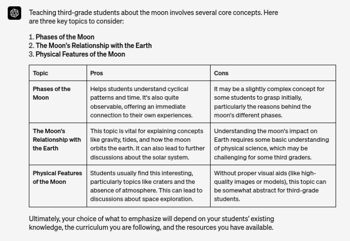
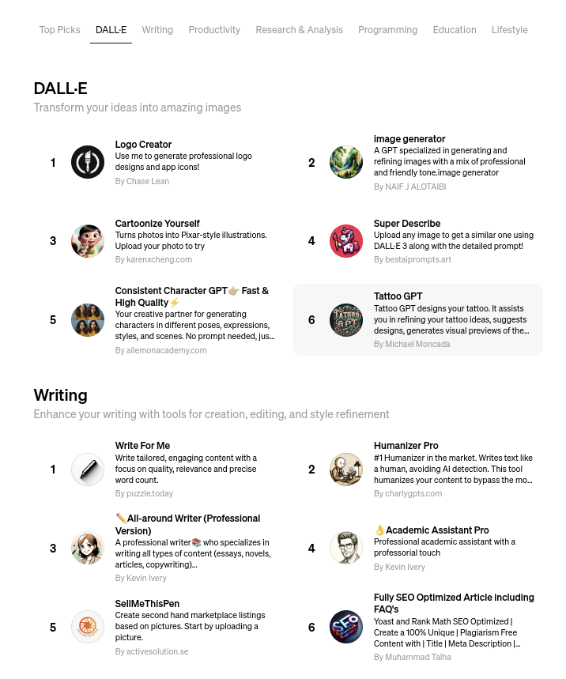

## Review de la GPT store

##### Publicado el {{PUBLISH_DATE}}

<!-- TITLE_IMAGE -->

El 10 de enero, OpenAI anunció la creación de la tienda ChatGPT. En este artículo, intentaré explicar en qué consiste este nuevo desarrollo. Para contextualizar, revisaré algunos anuncios anteriores que son clave para comprender la tienda.

El primer anuncio, realizado el 20 de julio de 2023, introdujo las "instrucciones personalizadas". Según el artículo de OpenAI:

"ChatGPT tendrá en cuenta sus instrucciones personalizadas para cada conversación a partir de ahora. El modelo tendrá en cuenta estas instrucciones cada vez que responda, eliminando la necesidad de repetir sus preferencias o información en cada conversación".

A continuación, se incluye un ejemplo ilustrativo del sitio web de OpenAI:

"Un profesor que elabora un plan de clase para ciencias de tercer grado ya no necesita especificar el nivel de grado cada vez".

Básicamente, las instrucciones personalizadas permitieron a los usuarios optimizar sus interacciones con ChatGPT.

Luego, el 6 de noviembre de 2023, OpenAI presentó los "GPT": versiones personalizadas de ChatGPT diseñadas para fines específicos. Los usuarios pueden ingresar datos para que ChatGPT los analice, enfocando sus capacidades en una tarea en particular.

Por ejemplo, quería crear una versión personalizada de ChatGPT para ayudar a escribir artículos técnicos sobre nuevas tecnologías en inteligencia artificial y computación en la nube. La interacción con el sistema me resultó intuitiva. A través de una serie de preguntas simples, configuré mi GPT "escritor técnico". A continuación, se muestra la conversación que tuve con GPT Builder para crear esta versión especializada.

Después de este proceso, puede interactuar con el GPT recién creado en la sección de vista previa. En la pestaña "Configurar" del generador de GPT, hay un formulario que resume la información de entrada para la creación del GPT.

En el lado derecho de la pantalla, hay una consola de vista previa para interactuar con su nuevo GPT. Como prueba, le pedí que escribiera un artículo que explicara el concepto de kernels en el aprendizaje profundo y que creara una imagen de encabezado para este artículo.

Los resultados fueron muy satisfactorios. El texto era técnico pero comprensible, como se le pidió, y la imagen generada evocaba conceptos como matrices y redes neuronales.

Una vez que estés satisfecho con el resultado, puedes guardar el GPT para uso privado o compartirlo públicamente en la Tienda ChatGPT.

Si lo guardas de forma privada, aparece en tu interfaz ChatGPT para uso personal. Si lo compartes de forma pública, queda disponible en la Tienda ChatGPT para que lo usen otros.

Y así es como llegamos a la Tienda. Una vez que se aprueba el GPT, podemos interactuar con la comunidad compartiendo nuestras creaciones e ideas en forma de GPT. La Tienda GPT muestra estos GPT, los clasifica en secciones y presenta los que son tendencia. Representa una oportunidad para colaborar con otros, desafiarnos a nosotros mismos y explorar nuevas ideas que podrían resolver problemas de automatización para muchas personas.

Una vez dentro de la tienda, el uso es tan sencillo como buscar y hacer clic en el GPT deseado e iniciar sesión en ChatGPT. Luego debería aparecer en su interfaz listo para usar.

Sin embargo, encontré un problema en la interfaz de usuario. Mientras estaba conectado a ChatGPT, no podía acceder a la tienda GPT directamente. La opción "explorar" solo mostraba los GPT que había usado anteriormente o los creados por OpenAI. Para encontrar un GPT específico, tuve que abrir una nueva ventana privada del navegador, buscar el GPT, copiar su enlace y luego acceder a él desde mi sesión iniciada. Abordar este problema mejoraría significativamente la experiencia del usuario.

En resumen, hemos revisado los conceptos de Instrucciones personalizadas y GPT, y cómo se integran con la tienda GPT. El papel de la comunidad será crucial para el éxito de esta iniciativa, así como la eficacia del sistema de clasificación y los avances de las capacidades de ChatGPT. Además, la creatividad de las personas a la hora de identificar problemas nuevos e interesantes que se puedan resolver a través de esta herramienta será un factor clave para su éxito.