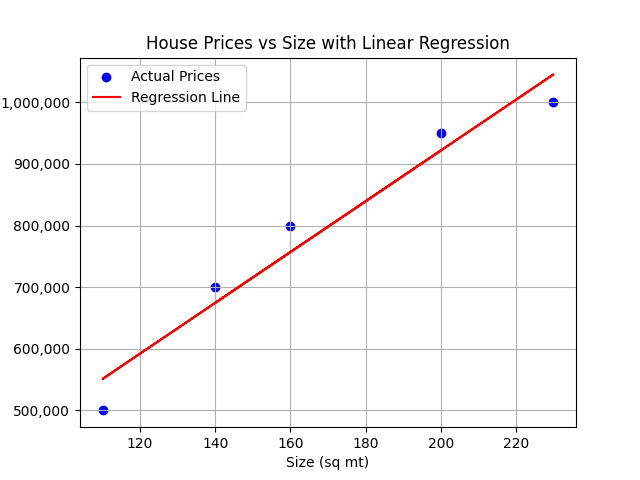
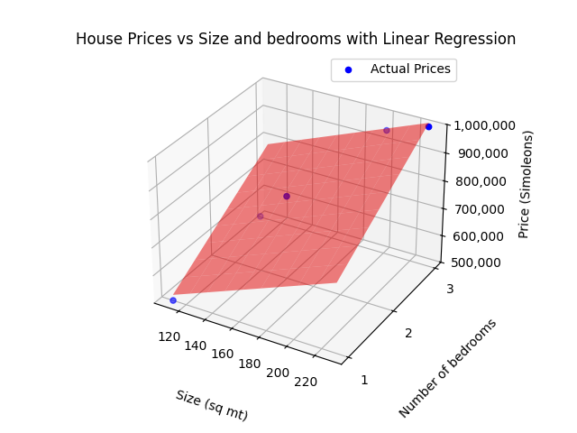

## Une introduction simple à l'apprentissage automatique

##### Publié le {{PUBLISH_DATE}}

<!-- TITLE_IMAGE -->

### 1. Qu’est-ce que l’apprentissage automatique ?

L'apprentissage automatique est un domaine de l'informatique qui permet aux ordinateurs d'apprendre et de s'adapter en fonction des données, sans avoir besoin d'une programmation explicite pour chaque tâche spécifique. Selon la définition d’Oxford Languages, l’apprentissage automatique est « l’utilisation et le développement de systèmes informatiques capables d’apprendre et de s’adapter sans suivre d’instructions explicites, en utilisant des algorithmes et des modèles statistiques pour analyser et tirer des conclusions à partir de modèles de données ».

Un type d’apprentissage automatique est un réseau neuronal. Mais avant de nous plonger dans les réseaux neuronaux, examinons un exemple plus simple d’apprentissage automatique pour construire une base solide : la prédiction des prix de l’immobilier.

**Un exemple concret : prédire les prix des logements**

Supposons que vous souhaitiez prédire le prix d’une maison en fonction de certaines caractéristiques, telles que le nombre de pièces, la taille de la maison, l’emplacement et l’année de sa construction.

Tout d’abord, je rassemblerais un ensemble de données de maisons dont je connais déjà les prix. Ces données peuvent être représentées dans un tableau, où chaque ligne est un enregistrement d'une maison avec des colonnes pour différentes caractéristiques (appelées caractéristiques ou prédicteurs) telles que la taille, les pièces, l'emplacement et l'année de construction. La colonne contenant le prix est notre variable cible ou dépendante : c'est la valeur que nous essayons de prédire.

|Taille (m²)| Chambres | Code postal | Année de construction | Prix ​​(Simoleons) |
|------------|------------|------------------|----------------|-------------------|
|1500 | 3 | 94121 | 2005 | 700 000 § |
|2500 | 4 | 94122 | 2010 | 1 000 000 § |
|1200 | 2 | 94123 | 1998 | 500 000 § |

Nous utiliserons ces données pour former notre modèle.

**Régression linéaire : un modèle simple de prédiction**

Pour faire cette prédiction, nous pouvons commencer par un modèle simple appelé régression linéaire. Essentiellement, la régression linéaire recherche une relation linéaire entre les fonctionnalités et la cible.

Imaginez que chaque ligne de données est un point dans un espace dimensionnel. Par exemple, si nous utilisons uniquement la taille des fonctionnalités, nous pourrions tracer les points de données dans un espace 2D, où l'axe des x représente la taille et l'axe des y représente le prix.

Dans ce scénario, la régression linéaire ajusterait une ligne aux données qui expliquent le mieux la relation entre la taille de la maison et le prix.

Dans ce scénario, la régression linéaire ajusterait une ligne aux données qui expliquent le mieux la relation entre les caractéristiques de la maison et le prix.

Maintenant, ajoutons de la complexité. Imaginons que nous utilisions deux fonctionnalités au lieu d’une, par exemple la taille et le nombre de pièces. Maintenant, nos points de données seraient distribués dans un espace 3D : l’axe des x pourrait représenter la taille, l’axe des y pourrait représenter les pièces et l’axe des z serait le prix de la maison. Ici, au lieu d’une ligne, la régression ajusterait un plan aux données.

Au fur et à mesure que nous ajoutons encore plus de fonctionnalités, il est difficile de visualiser. Dans un exemple avec n fonctionnalités, chaque enregistrement deviendrait un point dans un espace à (n+1) dimensions. Dans ce cas, notre modèle de régression s'adapte à un hyperplan (terme utilisé pour aller au-delà de trois dimensions) qui représente le mieux les points de données.

Une fois cet hyperplan créé, nous pouvons l’utiliser pour prédire des valeurs inconnues. Lorsque nous créons cet hyperplan, nous entraînons le modèle. Pour évaluer notre modèle, nous pourrions conserver certaines données à des fins de test, saisir de nouvelles valeurs de fonctionnalités et voir à quel point le prix prévu est proche du prix réel.

**Trouver la ligne, le plan ou l'hyperplan le mieux ajusté : la formule**

Dans la régression linéaire, la formule du modèle est :

Prix ​​= β₀ + β₁ * Fonctionnalité_1 + β₂ * Fonctionnalité_2 + ... + βₙ * Fonctionnalité_n

Chaque caractéristique possède un coefficient qui reflète son impact sur la cible. β₀ est l'interception, ou prix de base, lorsque toutes les caractéristiques sont nulles.

Dans notre exemple de prix de l’immobilier, cela pourrait ressembler à ceci :

Prix ​​= β₀ + β₁(Taille) + β₂(Piècees) + β₃*(Emplacement) + β₄*(Année de construction)

Notre objectif est de trouver les valeurs pour ces coefficients qui correspondent le mieux aux données. Il existe différentes manières de calculer ces valeurs ; Nous allons brièvement examiner deux d’entre eux : les moindres carrés et la descente de gradient.

**Méthode 1 : Moindres carrés**

La méthode des moindres carrés nous fournit une solution exacte lors de la résolution d’équations mathématiques basées sur des données. Dans les cas avec une seule fonctionnalité, c'est assez efficace, car vous n'avez besoin de vérifier chaque point de données qu'une seule fois. Mais lorsque vous avez plusieurs fonctionnalités, cela nécessite des calculs plus complexes (opérations matricielles), ce qui peut devenir peu pratique pour les grands ensembles de données.

**Méthode 2 : Descente de gradient**

La descente de gradient est une méthode itérative et est souvent préférée lorsque l'on travaille avec plusieurs fonctionnalités ou de grands ensembles de données. Voici une version simplifiée des étapes :

1. Commencez par une estimation : commencez par une ligne aléatoire qui ne correspond pas bien aux données. Cette droite a une pente et une interception (position).
2. Vérifiez la distance : pour chaque maison de l'ensemble de données, mesurez la distance entre le prix prévu et le prix réel.
3. Ajustez la ligne : Ajustez légèrement la ligne en fonction de la distance à laquelle vous vous trouvez. Si les prédictions de ligne étaient trop élevées, ajustez-les à la baisse ; S'ils sont trop bas, ajustez-les vers le haut. De même, ajustez la pente si elle est trop raide ou trop plate.
4. Répétez : Continuez à ajuster la ligne petit à petit. Chaque ajustement permet à la ligne d'être plus précisément adaptée aux données.
5. Arrêtez-vous lorsque vous êtes suffisamment proche : lorsque la ligne correspond suffisamment aux données, nous arrêtons l'ajustement.

Pourquoi cela fonctionne-t-il ? Imaginez que vous visez une cible avec une fléchette. Chaque lancer (ou ajustement) vous aide à vous rapprocher et, au fil du temps, vous « apprenez » à frapper près du centre de la cible.

Voilà donc un exemple concret d’utilisation de l’apprentissage automatique et de la régression linéaire pour prédire des valeurs en fonction des données. Il existe de nombreuses autres méthodes permettant de réaliser des prédictions avec l’apprentissage automatique. Je vous recommande de visiter le [site Web scikit-learn](https://scikit-learn.org/stable/) pour approfondir votre compréhension de ces méthodes. Avec cette base, vous avez désormais une compréhension de base du fonctionnement de l’apprentissage automatique et êtes prêt à commencer à explorer ce domaine fascinant plus en profondeur.