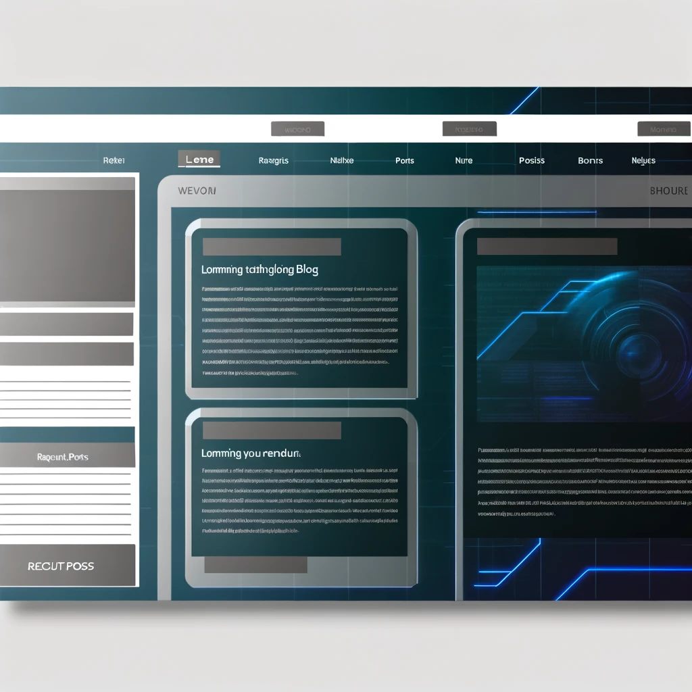

## Test utilisateur Dall-e 3

##### Publié le {{PUBLISH_DATE}}

<!-- TITRE_IMAGE -->

[Image créée par ChatGPT, OpenAI, 20 février 2024](../../images/dalle3_user_test_title_img.webp)

*Avertissement : Dall-E 3 est disponible exclusivement dans la version payante de ChatGPT.*

Aujourd'hui, je suis ravi de partager avec vous quelques défis fascinants que j'ai récemment relevés en utilisant DallE-3, le générateur d'images textuelles d'OpenAI. Voici un fait amusant : le nom « Dall-E » est un mélange de Wall-E (l'adorable personnage de Pixar) et de Salvador Dali, l'artiste légendaire.

Cet outil est vraiment remarquable et simplifie grandement le processus d’imagerie. Son utilisation est très simple : il suffit de fournir une idée en entrée et le modèle crée une image basée sur ce concept.

L’une de mes premières expériences a été de demander une image représentant un producteur de café avec Pikachu (oui, le personnage Pokémon). Ce sont deux concepts très différents, mais le résultat était tout simplement spectaculaire. La plantation de café et le producteur de café ont été représentés avec un réalisme surprenant, et Pikachu semblait sortir tout droit de son monde fictif. Il y a eu quelques écarts par rapport au personnage original, notamment la longue queue avec une boule de fourrure, mais je dois dire que j'ai été très impressionné. L’image dégage un charme unique, fusionnant parfaitement les deux concepts. C'est tellement impressionnant que j'envisage de l'imprimer pour l'accrocher sur mon mur.

[Image créée par ChatGPT, OpenAI, 20 février 2024](../../images/dalle3_user_test_coffe_pikachu.webp)

*Image créée par ChatGPT, OpenAI, 20 février 2024*

Mais toutes les technologies, surtout les nouvelles, présentent des défauts difficiles à surmonter. Maintenant, laissez-moi partager avec vous quelques exemples où la génération d’images a un peu déraillé.
### Citation de texte en images

J'ai décidé de commencer par quelque chose de simple, j'ai donc donné cette commande à ChatGPT :

**Pouvez-vous générer une image d'un champ et d'un arc-en-ciel et à l'intérieur de l'arc-en-ciel le texte suivant « Carlos est un humain, pas un lutin » ?**

*Image créée par ChatGPT, OpenAI. 20 février 2024*

Je dois dire que j'ai été plutôt satisfait du résultat. Le texte a été cité correctement, ce qui est une grande victoire. Cependant, cela ne se fond pas bien dans l'image ; Cela semble imposé et artificiel, et surtout, c'est sous l'arc-en-ciel, mais pas à l'intérieur.

J'ai donc réessayé, cette fois en demandant :

**Pouvez-vous générer une image d'un champ et d'un arc-en-ciel et à l'intérieur de l'arc-en-ciel le texte suivant « Carlos est un humain, pas un lutin » ? Assurez-vous que le texte suit la forme de l'arc-en-ciel.**

*Image créée par ChatGPT, OpenAI. 20 février 2024*

Cette tentative a eu des résultats mitigés. Le texte était là où je l'attendais, c'est une victoire ! Les lettres étaient claires et lisibles, mais le problème principal, récurrent dans DALL-E, était l'ajout ou la suppression de lettres, même si j'avais fourni le même texte. « Carlos » a gagné un « R » supplémentaire et « duende » en a perdu un. Il semblait que le modèle souffrait d’une forme particulière de dyslexie.
C'est tellement impressionnant que je pense l'imprimer pour l'accrocher sur mon mur.
### Génération d'interface Web

Ensuite, je voulais que DALL-E 3 m’aide à générer un modèle d’interface pour un blog imaginaire.

Ma première commande était :

**Pouvez-vous créer une interface de blog technologique avec du texte clairement affiché ?**

*Image créée par ChatGPT, OpenAI. 20 février 2024*

Le résultat initial a été décevant. Le texte n’était pas en anglais et n’était pas cohérent ; c'était un fouillis de lettres. L’image globale était assez décevante et loin d’être prête pour un quelconque processus de production.

Déterminé, j'ai fait une demande plus détaillée à ChatGPT, dans l'espoir de résoudre certains problèmes. La commande était :

**Pouvez-vous créer une interface pour un blog technologique ? J'aimerais voir des boutons qui redirigent vers l'accueil, le big data, l'intelligence artificielle, l'économie, les technologies émergentes, à propos de nous et le contact. J'aimerais également voir trois articles affichés sur l'interface, chacun avec les titres suivants : « Les robots vont-ils nous mettre au chômage ? », « Comment mettre en œuvre l'IA dans le bureau moderne ? », « La nouvelle ère du développement logiciel ». J'aimerais également que le logo du blog soit basé sur un radar.**

[Image créée par ChatGPT, OpenAI, 20 février 2024](../../images/dalle3_user_test_web_interface_2.webp)

*Image créée par ChatGPT, OpenAI. 20 février 2024*

Nous sommes désormais sur la bonne voie. L'interface semble beaucoup plus agréable et plus cohérente. Le radar en guise de logo est présent. Cependant, j’étais toujours déçu ; Il y a des sections qui se répètent, comme le bouton d'accueil deux fois. Il y a un titre pour chaque article, ce qui est bien, mais non seulement des lettres et des chiffres sont ajoutés ou supprimés au hasard, parfois même les lettres semblent être dessinées de manière incorrecte. Le texte de chaque article n’a tout simplement aucun sens. Cela ressemble à une collection aléatoire de lettres qui sont visuellement acceptables, mais il n'y a rien de cohérent ou de lié qui puisse être lu. Il est assez ironique que Chat GPT produise des textes aussi sophistiqués et corrects, et que DALL-E 3 semble incapable de comprendre même les concepts les plus élémentaires de la grammaire. Mais cela semble être la réalité aujourd’hui.

En guise de dernière tentative, j'ai ajouté :

**Je souhaite que le texte de chaque article soit rédigé en anglais. Le texte doit être lié à l'en-tête situé au-dessus.**

[Image créée par ChatGPT, OpenAI, 20 février 2024](../../images/dalle3_user_test_web_interface_3.webp)

*Image créée par ChatGPT, OpenAI, 20 février 2024*

Tout d’abord, l’évidence : il n’y a eu aucune amélioration dans la génération de textes pour les articles. Je pourrais même dire qu'il y a eu une dégradation, car les caractères ne sont désormais plus clairement lisibles. Cependant, cet exemple présente quelques aspects intéressants. L'un des titres est parfaitement lisible selon l'entrée donnée, « Les robots vont-ils nous mettre au chômage ? », mais les autres ne le sont pas. Dans certains cas, il semble que pour DALL-E 3, l'ordre des lettres n'est pas pertinent, ou qu'il fait des choix étranges et grammaticalement incorrects si l'espace n'est pas suffisant. Certaines sections sont tout simplement manquantes et d’autres sont répétées plusieurs fois.

Pour ce cas d’utilisation particulier, c’est un outil de modèle décent pour créer un prototype rapide. Cependant, l’intervention humaine et des logiciels spécialisés sont toujours nécessaires pour obtenir un produit final viable. En particulier, la génération de texte constitue un défaut majeur.

Puis j'ai demandé :

**Dessinez une sorcière tenant un bâton dans sa main gauche**

*Image créée par ChatGPT, OpenAI. 20 février 2024*

Puis j'ai demandé : « Dessinez une sorcière tenant un bâton dans sa main gauche. »** DALL-E 3 a compris ma demande dans une certaine mesure ; La sorcière tenait un bâton, mais avec les deux mains. Il lui manquait l’intelligence nécessaire pour déduire que « le tenir avec sa main gauche » signifiait utiliser uniquement cette main. Cependant, vous pourriez arguer que mes instructions n’étaient pas assez précises.

J'ai donc essayé une nouvelle requête :

**Dessinez un sorcier tenant un bâton avec seulement sa main gauche**

*Image créée par ChatGPT, OpenAI. 20 février 2024*

L'image montrait le sorcier le tenant avec sa main droite. Il semble que DALL-E ne comprenne pas complètement la position des parties du corps, à l'instar de l'erreur que font certains humains lorsqu'ils se regardent dans un miroir.

J'ai trouvé que DALL-E 3 était un outil amusant pour créer des affiches publicitaires, ce qui est logique étant donné l'omniprésence de la publicité dans notre société. Alors, j'ai réfléchi à ce à quoi ressemblerait une affiche de parfum français en Colombie selon ChatGPT et j'ai demandé :

**Pouvez-vous créer une affiche publicitaire de parfum français pour le marché colombien ?**

*Image créée par ChatGPT, OpenAI. 20 février 2024*

J'ai adoré le résultat ; Cela semblait si typique, j'oserais dire même stéréotypé, de la Colombie, avec les fleurs, l'architecture coloniale et les montagnes. Cela m’a rappelé certaines villes rurales de la campagne. Et le flacon de parfum a l'air si chic et élégant, rappelant la sophistication française. Un mélange subtil. Le seul problème, cependant, était que le texte était erroné. Pas aussi grave que dans d’autres cas ; Pour une raison que j'ignore, dans ma tête, cela ressemblait même un peu au portugais ou à une autre langue romane, avec les accents sur le « A » de « Francesesa » qui devrait être « français », de toute façon, ou sur « Excéconalles » qui devrait être « exceptionnel ». Le seul problème était le texte : pas complètement faux, mais un peu déplacé, il sonnait presque comme du portugais. Le placement du texte était correct ; ce n'était tout simplement pas en espagnol. Mais c'était presque compréhensible. Les textes corrects devraient être :

Prochainement :

**Pouvez-vous me dessiner un diagramme de classes UML pour un magasin ?**

*Image créée par ChatGPT, OpenAI. 20 février 2024*

Bien qu'elle soit assez belle, cette image présente quelques problèmes. Le problème le plus évident est qu’il n’adhère pas à la norme UML. Il existe une convention spécifique pour représenter une classe ou une interface, comme l'utilisation de flèches pour indiquer les relations entre les classes, telles que l'héritage ou la dépendance. Bien que l’image soit visuellement attrayante, elle ne répond pas à ces normes. De plus, sans prendre en compte les étiquettes répétées et les mots mal orthographiés, il est impossible d’imaginer un véritable logiciel basé sur cette image.

*Pouvez-vous me dessiner un diagramme de relation d'entité de base de données pour un restaurant ?*

*Image créée par ChatGPT, OpenAI. 20 février 2024*

Une fois de plus, nous sommes confrontés au même problème : une image visuellement frappante entachée d’un texte incohérent qui ne répond pas à des normes spécifiques et ne fournit pas une représentation suffisamment claire d’un schéma de base de données.

Lorsque nous avons affiné la demande, nous avons obtenu un résultat légèrement amélioré.

**Pouvez-vous me dessiner un diagramme de relation d'entité de base de données pour un restaurant qui suit la norme de Peter Chen ?**

*Image créée par ChatGPT, OpenAI. 20 février 2024*

Bien que ce résultat soit plus proche des attentes, il présente encore plusieurs problèmes. Pour commencer, il y a des erreurs grammaticales, comme « Employé » au lieu de « Employé ». La table des entités, en particulier la table du restaurant, est répétée de manière redondante. De plus, les relations entre les entités, généralement représentées dans un losange, sont manquantes. Les relations dans ces diagrammes sont similaires aux verbes qui relient des entités, par exemple, « l'employé attend les tables ». Malheureusement, cet aspect crucial est complètement absent de l'image, ce qui la rend absurde."

Enfin, j'ai voulu tester DALL-E 3 avec deux concepts qui utilisaient le même mot. Choisiriez-vous des embouteillages ou de la confiture de fraises ? Les résultats étaient super mignons, surprenants et amusants. J'ai demandé:
**Veuillez dessiner une fraise dans un embouteillage**

*Image créée par ChatGPT, OpenAI. 20 février 2024*

**Veuillez dessiner une fraise dans un embouteillage**

*Image créée par ChatGPT, OpenAI. 20 février 2024*

**Veuillez dessiner une fraise dans un embouteillage**

*Image créée par ChatGPT, OpenAI. 20 février 2024*

Je voulais terminer sur cette note car c'était la partie la plus amusante du test. Je pense que l’une des plus grandes forces de DALL-E est le mélange créatif de concepts. C'est fantastique pour prototyper de nouvelles idées et développer la créativité, le tout en quelques secondes. L’une de ses faiblesses les plus importantes est la génération d’images contenant du texte cohérent. Ce problème diminue grandement son utilité pour créer des interfaces Web ou des images publicitaires où le message est crucial. Au minimum, cela nécessite un certain post-traitement ; Ce n’est pas une solution prête à l’emploi. Une autre faiblesse notable est la génération précise de diagrammes qui adhèrent à des normes spécifiques. DALL-E n'est pas programmé pour suivre ces directives strictes et ne comprend pas pleinement les systèmes que ces normes représentent. Mes dernières réflexions : Cet outil, malgré ses imperfections, accélère considérablement le processus de génération d’images. Il démocratise, rationalise et réduit les coûts de création d’images, ce qui profite particulièrement aux petites entreprises et aux utilisateurs individuels qui n’ont pas accès à une équipe marketing ou à des professionnels de la conception.